# M300-Plattformübergreifende-Dienste-in-ein-Netzwerk-integrieren
Toolumgebung für Modul 300

Git Hub,Git Bash, Virtualbox, Vagrant & Apache

#### Inhaltsverzeichnis

* 10 - [Toolumgebung aufsetzen](#10---Toolumgebung-aufsetzen)
  * 01 - [GitHub Account](#01---github-account)
  * 02 - [Git Client](#02---git-client)
  * 03 - [VirtualBox](#03---virtualbox)
  * 04 - [Vagrant](#04---vagrant)
  * 05 - [Visual Studio Code](#05---visual-studio-code)

* 20 - [Infrastruktur-Automatisierung](#20---infrastruktur-automatisierung)
  * 01 - [Cloud Computing](#01---cloud-computing)
  * 02 - [Infrastructure as Code (IaC)](#02---infrastructure-as-code-iac)
  * 03 - [Vagrant](#03---vagrant)
  * 04 - [Packer](#04---packer)
  * 05 - [AWS Cloud](#05---aws-cloud)
  * LB2 - [LB2 hands-on](#lb2-hands-on)

* 25 - [Sicherheit](#25---sicherheit)
  * Fragen - [Firewall und Reverse Proxy](#Fragen---firewall-und-reverse-proxy)
  * 01 - [Firewall & Reverse Proxy](#01---firewall-&-reverse-proxy)
  * 02 - [Benutzer- & Rechteverwaltung](#02---benutzer--&-rechteverwaltung)
  * 03 - [SSH](#03---ssh)
  * 04 - [Authentifizierung & Autorisierung](#04---authentifizierung-&-autorisierung)
  
* 30 - [Container](#30---container)

* 35 - [Sicherheit](#35---sicherheit)

* 40 - [Kubernetes (K8s)](#40---kubernetes-k8s)

* 50 - [Projekte](#50---projekte)
  * 01 - [Docker Projekt - Gitea Git Server](#01---docker-projekt---gitea-git-server)
  * 02 - [Aufgetretene Fehler & Lösungen](#02---aufgetretene-fehler-&-lösungen)

* 80 - [Ergänzungen zu den Unterlagen](#80---ergänzungen-zu-den-unterlagen)

---

10 - Toolumgebung aufsetzen
===================

Hier wird die Installation von GitHub, VirtualBox, Vagrant und Visual Studio Code durchgeführt.


01 - GitHub Account
===

> [⇧ **Nach oben**](#inhaltsverzeichnis)

## Account erstellen

Zunächst wurde ein GitHub-Account auf https://www.github.com erstellt.

Folgende Angaben wurden gemacht:

- Benutzername: IKovachevska
- E-Mail-Adresse: kovacevskai11@gmail.com
- Passwort: ...

Nach der Registrierung wurde die E-Mail zur Verifizierung des Kontos bestätigt und anschliessend auf GitHub angemeldet.

## Repository erstellen

Nach der Anmeldung wurde ein neues Repository <strong>M300 -Services</strong> erstellt.

Vorgehen:

1. Klick auf **Start a project**
2. Repository Name: `M300-Services`
3. Sichtbarkeit: **Public**
4. Option **Initialize this repository with a README** aktiviert
5. Klick auf **Create repository**

Das Repository wurde erfolgreich erstellt.

## SSH-Key erstellen und dem SSH-Agent hinzufügen

Vorgehen

1.  Terminal (*Bash*) öffnen
2.  Folgenden Befehl mit der Account-E-Mail von GitHub einfügen:
    ```Shell
      $  ssh-keygen -t rsa -b 4096 -C "kovacevskai11@gmail.com"
    ```
3. Neuer SSH-Key wird erstellt.

4. Bei der Abfrage, unter welchem Namen der Schlüssel gespeichert werden soll, die Enter-Taste drücken (für Standard):
    ```Shell
      Enter a file in which to save the key (~/.ssh/id_rsa): [Press enter]
    ```
5. Nun kann ein Passwort für den Key festgelegt werden. 
    ```Shell
      Enter passphrase (empty for no passphrase): [Passwort]
      Enter same passphrase again: [Passwort wiederholen]
    ```


1. Auf Benutzerkonto klicken (oben rechts) und den Punkt <strong>Settings</strong> aufrufen
2. Unter den Menübereichen auf der linken Seite zum Abschnitt <strong>SSH und GPG keys</strong> wechseln
3.  Auf <strong>New SSH key</strong> klicken
4.  Im Formular unter <strong>Title</strong> eine Bezeichnung vergeben (MB SSH-Key)
5.  Den zuvor kopierten Key mit <i>CTRL + V</i> einfügen und auf <strong>Add SSH key</strong> klicken
6.  Der SSH-Key wurde erfolgreich hinzugefügt.


##
02 - Git Client
===

> [⇧ **Nach oben**](#inhaltsverzeichnis)

1. Git Client installiert und befähigt.
2. Client wie folgt konfiguriert:

    ```Shell
      $ git config --global user.name "<IKovachevska>"
    ```

    ```Shell
      $ git config --global user.email "<kovacevskai11@gmail.com>"
    ```

## Repository klonen

1. Repository mit SSH klonen:

    ```Shell
      $ git clone https://gitlab.com/ch-tbz-it/Stud/m300/m300
      $ cd M300-Services
      $ git pull
      $ git status
    ```

2. Ergebnis:

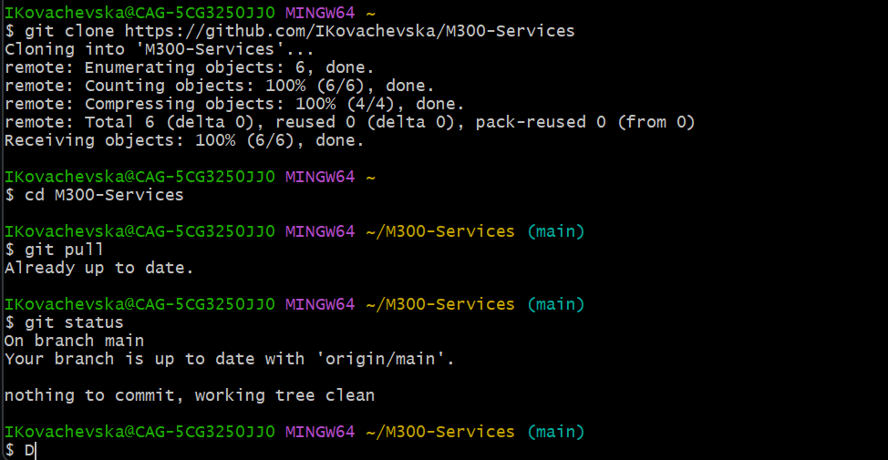


## Repository herunterladen & aktualisieren (clone/pull)

1. Ordner für Repository im gewünschten Verzeichnis erstellen, Repository mit SSH klonen und aktualisieren:

    ```Shell
      $ mkdir MeinLokalesRepository
      $ cd M300
      $ git clone git@github.com:IKovachevska/M300-Services.git
      $ git pull
    ```

## 
03 - VirtualBox
===

> [⇧ **Nach oben**](#inhaltsverzeichnis)

VirtualBox wurde von der offiziellen Webseite heruntergeladen und installiert.

## VM erstellen

Neue VM erstellt mit folgenden Einstellungen:

- Name: M300_Ubuntu_22.04_Desktop
- Typ: Linux
- Version: Ubuntu (64-bit)
- RAM: 2048 MB
- CPU: 2 Kerne
- Festplatte: 25 GB
- Typ: VMDK
- Dynamisch alloziert

## VM einrichten

1. Ubuntu-VM starten
   
2. Terminal (Bash) öffnen
   
3. Paketliste neu einlesen und Pakete aktualisieren:

    ```bash
      $ sudo apt-get update   
      $ sudo apt-get upgrade   
      $ sudo reboot     
    ```

4. Software Controlcenter "Synaptic" installieren:
   
    ```bash
      $ sudo apt-get install synaptic     
    ```

5. Apache installieren:

    ```bash
      $ sudo apt-get install apache2
    ```

6. System-Neustart durchführen:

    ```bash
      $ sudo reboot
    ```

Test im Browser:

```
http://127.0.0.1
```

Apache-Standardseite wurde angezeigt.


## 
04 - Vagrant
===

> [⇧ **Nach oben**](#inhaltsverzeichnis)

Die Software installiert und befähigt.

## Virtuelle Maschine erstellen

1. In dem gewünschten Verzeichnis einen neuen Ordner für die VM angelegt:

     ```bash
       $ cd C:\Users\IKovachevska\M-300
       $ mkdir MeineVagrantVM
       $ cd MeineVagrantVM
     ```

2. Vagrantfile erzeugt, VM erstellt und entsprechend gestartet:    

      ```bash
       $ vagrant init ubuntu/xenial64        
       $ vagrant up --provider virtualbox    
     ```   

    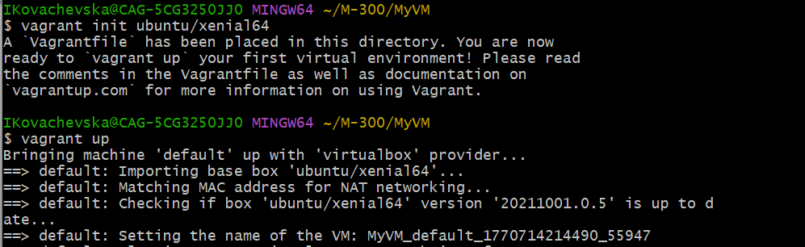

3. Die VM ist nun in Betrieb und kann via SSH-Zugriff bedient werden:

      ```bash
       $ cd C:\Users\IKovachevska\M-300\MeineVagrantVM         
       $ vagrant ssh  

       $ ls -l /bin
	   $ df -h 
	   $ free -m   
     ```   

## Apache Webserver automatisiert aufsetzen

1. In das M300-Verzeichnis wechseln:

      ```bash
       $ cd C:/Users/IKovachevska/m300/vagrant/web
     ```   

2. VM erstellen und starten:

      ```bash
       $ vagrant up
     ```   

3. Webbrowser in der VM öffnen http://127.0.0.1:8080 und prüfen ob das erreichbar ist.

4. Im Ordner /web die Hauptseite index.html editieren bzw. durch eine andere ersetzen (z.B. HTML5up-Themplate) und das Resultat überprüfen:
   
    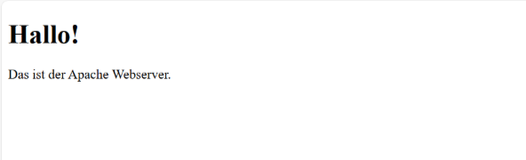

5. VM anschlissend mit folgendem Befehl gelöscht:
   
      ```bash
       $ vagrant destroy -f
     ```   


##
05 - Visual Studio Code
===

> [⇧ **Nach oben**](#inhaltsverzeichnis)

Die Software war bereits installiert und einsatzfähig.

## Extensions installieren

Benötigte Extensions installiert:

- Markdown All in One (von Yu Zhang)
- Vagrant Extension (von Marco Stanzi)
- vscode-pdf Extension (von tomiko1207)
- Auto Markdown TOC (huntertran.auto-markdown-toc)

## Einstellungen anpassen

1. Unter File > Preferences > Settings (Ctrl + ,) auf <strong>Open setting.json</strong> klicken.

2. Hier diesen Code einfügen:
   
   // Konfiguriert die Globmuster zum Ausschließen von Dateien und Ordnern.

      ```bash
        "files.exclude": {
          "**/.git": true,
          "**/.svn": true,
          "**/.hg": true,
          "**/.vagrant": true,
          "**/.DS_Store": true
        },
     ``` 
3. Die Datei sollte schlussendlich wie folgt aussehen - dann speichern:
   
    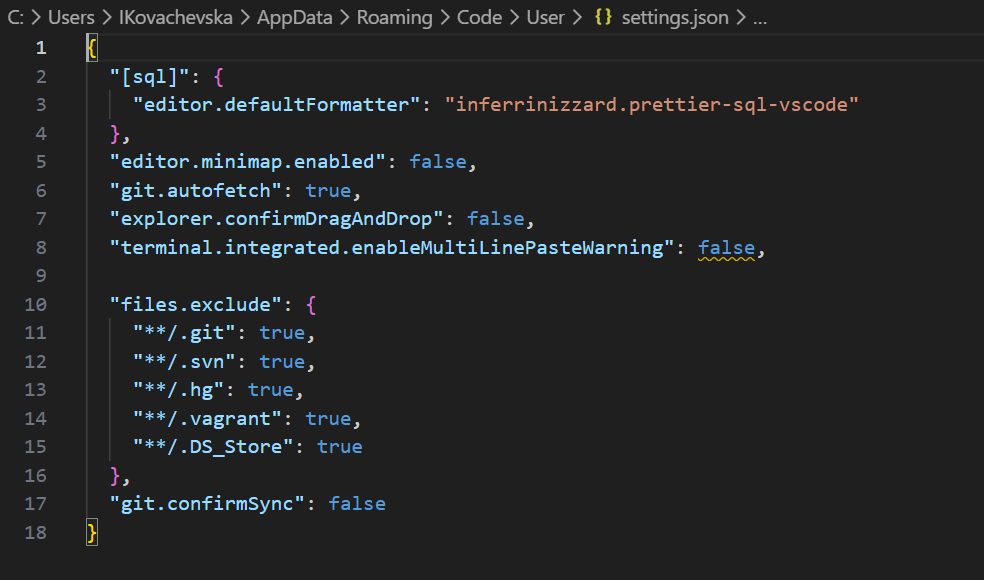

## Repository hinzufügen & pushen

- Änderungen an entsprechenden Dateien vorgenommen
- In der linken Leiste das Symbol mit einer "1" aufgerufen
- Unter dem Abschnitt Changes die betroffenen Files bezüglich ihres Changes "stagen" (Stage Changes)
- Nachricht hinterlegt (Message) und Haken (Commit) gesetzt

    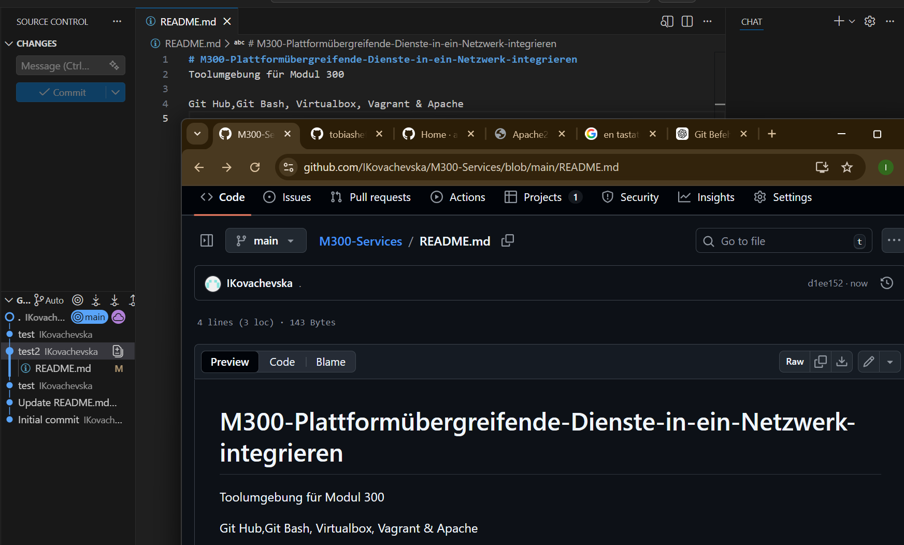


20 - Infrastruktur-Automatisierung
===================

Hier wird das Einrichten einer Dynamischen Infrastruktur-Plattform (Private Cloud) auf Basis von konsistenten und wiederholbaren Definitionen gezeigt.


##
01 - Cloud Computing
===

> [⇧ **Nach oben**](#inhaltsverzeichnis)

Cloud Computing bedeutet, dass IT-Ressourcen wie Server, Speicher, Netzwerke oder Software nicht lokal, sondern über das Internet bereitgestellt und genutzt werden. Der Zugriff erfolgt über technische Schnittstellen (APIs) oder Browser.

## Arten von Cloud Computing

IaaS (Infrastructure as a Service):

- Virtuelle Server, Speicher und Netzwerke. Der Nutzer verwaltet Betriebssystem und Software selbst.
- Beispiele: AWS EC2, Azure VM

---

PaaS (Platform as a Service):

- Plattform für Entwickler, ohne Serververwaltung.
- Beispiele: Azure App Service, Google App Engine

---

SaaS (Software as a Service):

- Fertige Anwendungen, keine Administration nötig.
- Beispiele: Microsoft 365, Google Drive

---

CaaS (Container as a Service):

- Ausführung von Containern (z. B. Docker, Kubernetes) zwischen IaaS und PaaS.

---

##
02 - Infrastructure as Code (IaC)
===

> [⇧ **Nach oben**](#inhaltsverzeichnis)

<strong>Infrastructure as Code</strong> beschreibt die automatisierte Bereitstellung und Konfiguration von IT-Infrastruktur mithilfe von Code.

<strong>Vorteile:</strong>

- Wiederholbar & konsistent
- Schnellere Bereitstellung
- Weniger Fehler durch Automatisierung
- Versionskontrolle und Nachvollziehbarkeit

---

<strong>Wichtige Konzepte:</strong>

- Versionsverwaltung (Git)
- Continuous Integration / Delivery (CI/CD)
- Automatisierte Tests

---

<strong>Wichtige Tools:</strong>

- <strong>Infrastructure Definition:</strong> Terraform, CloudFormation
- <strong>Server-Konfiguration:</strong> Vagrant, Docker, Packer
- <strong>Package Management:</strong> PAPT, YUM
- <strong>Scripting:</strong> Bash, PowerShell
- <strong>Repositories:</strong> GitHub, Docker Hub, Vagrant Cloud
  
##
03 - Vagrant
===

> [⇧ **Nach oben**](#inhaltsverzeichnis)

Vagrant ist ein CLI-Tool zur einfachen Erstellung und Verwaltung von virtuellen Maschinen.

## Funktionsweise & Konzepte

CLI - Befehle:

| Befehl                    | Beschreibung                                                      |
| ------------------------- | ----------------------------------------------------------------- | 
| `vagrant init`            | Initialisiert im aktuellen Verzeichnis eine Vagrant-Umgebung und erstellt, falls nicht vorhanden, ein Vagrantfile |
| `vagrant up`              |  Erzeugt und Konfiguriert eine neue Virtuelle Maschine, basierend auf dem Vagrantfile |
| `vagrant ssh`             | Baut eine SSH-Verbindung zur gewünschten VM auf                   |
| `vagrant status`          | Zeigt den aktuellen Status der VM an                              |
| `vagrant port`            | Zeigt die Weitergeleiteten Ports der VM an                        |
| `vagrant halt`            | Stoppt die laufende Virtuelle Maschine                            |
| `vagrant destroy`         | Stoppt die Virtuelle Maschine und zerstört sie.                   |

## Boxen / Konfiguration / Provisioning / Provider

1. Einen neuen Ordner in das MeineVagrantVM - Verzeichnis erstellt:
   
      ```bash
        $ cd C:\Users/IKovachevska/M-300/MeineVagrantVM
        $ mkdir 20_A03
        $ cd 20_A03
        $ vagrant init ubuntu/xenial64
     ``` 

    

2. Vagrantfile anpassen:

      ```bash
        Vagrant.configure("2") do |config|
          config.vm.box = "ubuntu/xenial64"

          # Port Forwarding
          config.vm.network "forwarded_port", guest: 80, host: 8080

          # Apache automatisch installieren
          config.vm.provision "shell", inline: <<-SHELL
           sudo apt-get update
           sudo apt-get -y install apache2
          SHELL

          # VirtualBox Provider Einstellungen
          config.vm.provider "virtualbox" do |vb|
            vb.memory = "512"
          end
        end
     ``` 

    

3. Browser:
   
   http://localhost:8081

    

### Ergänzung

<strong>Konfiguration:</strong>

Die gesamte VM-Konfiguration erfolgt im Vagrantfile.
Dabei wurden folgende Einstellungen vorgenommen:

- Verwendung der Box ubuntu/xenial64
- Festlegung des Hostnamens auf srv-web
- Portweiterleitung von Port 80 (Guest) auf Port 8081 (Host)
- Automatische Installation von Apache mittels Shell-Provisioning
- Zuweisung von 512 MB Arbeitsspeicher über den VirtualBox-Provider

---

<strong>Provisioning:</strong>

Durch das integrierte Shell-Provisioning wird beim Start der VM automatisch:

- die Paketliste aktualisiert (apt-get update)
- der Apache-Webserver installiert (apt-get install apache2)
  
Dies ermöglicht eine automatisierte Serverbereitstellung.

---

<strong>Provider:</strong>

Als Provider wird VirtualBox verwendet.
Die VM wurde mit 512 MB RAM konfiguriert.

## Workflow

### Box hinzufügen

1. Hinzufügen einer Box zur lokalen Registry:

      ```bash
        $ vagrant box add VagrantBox
     ``` 

2. In der lokalen Registry vorhandene Boxen anzeigen:
   
     ```bash
        $ vagrant box list
     ``` 

    

### VM erstellen

1. Vagrantfile erzeugen und Provisionierung starten:

     ```bash
        $ mkdir myserver
        $ cd myserver
        $ vagrantfile init ubuntu/xenial64
        $ vagrant up
     ``` 

2. Aktueller Status der VM anzeigen:

     ```bash
        $ vagrant status
     ``` 

### VM updaten

1. Nach Änderungen im Vagrantfile kann ein Server wie folgt aktualisiert werden:

     ```bash
        $ vagrant provision
     ``` 

### VM löschen

     ```bash
        $ vagrant destroy -f
     ``` 

## Synced Folders (Gemeinsame Ordner)

Synchronisierte Ordner ermöglichen es der VM auf Verzeichnisse des Host-Systems zuzugreifen.

1. In den Projektordner wechseln:
      ```bash
        $ cd myserver
     ```   

2. Vagrantfile anpassen:
   
     ```bash
        # -*- mode: ruby -*-
        # vi: set ft=ruby :

        Vagrant.configure("2") do |config|

         # Box
         config.vm.box = "ubuntu/xenial64"

         # Portweiterleitung (Host:8080 -> VM:80)
         config.vm.network "forwarded_port", guest: 80, host: 8080

         # Synced Folder (Projektordner -> Apache HTML Verzeichnis)
         config.vm.synced_folder ".", "/var/www/html"

         # VirtualBox Einstellungen
         config.vm.provider "virtualbox" do |vb|
          vb.memory = "1024"
          vb.cpus = 1
         end

         # Apache automatisch installieren
         config.vm.provision "shell", inline: <<-SHELL
          apt-get update
          apt-get install -y apache2
         SHELL

        End
     ``` 

    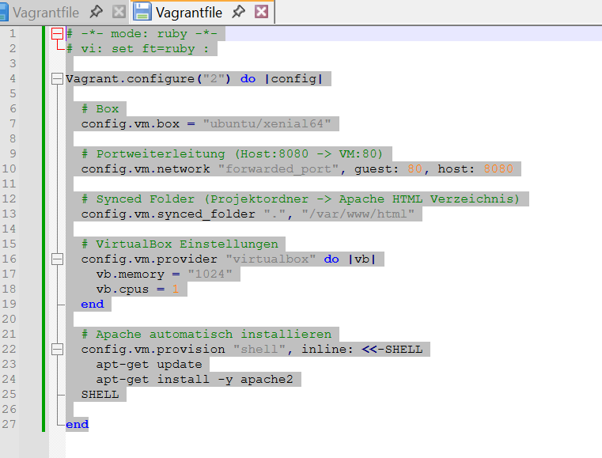

3. VM neu starten, damit die Änderung wirkt:

      ```bash
        $ vagrant reload
     ```   

### Ergänzung

Projektordner (wo das Vagrantfile liegt):

myserver/

wird in der VM unter /var/www/html eingebunden.

-	Alles, was ich im Host speichere, ist sofort in der VM verfügbar. (siehe <strong>DocumentRoot</strong> auf dem Screenshot)    

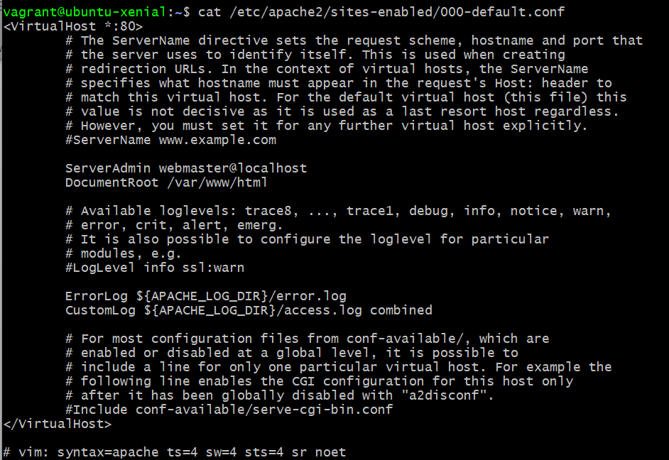

##
04 - Packer
===

> [⇧ **Nach oben**](#inhaltsverzeichnis)

Packer erstellt automatisiert VM-Images oder Vagrant-Boxen aus Konfigurationsdateien (JSON).

- <strong>Builder:</strong> Zielplattform (z. B. VirtualBox)
- <strong>Provisioner:</strong> Installation & Konfiguration
- <strong>Post-Processor:</strong> Erzeugt z. B. Vagrant-Boxen

##
05 - AWS Cloud
===

> [⇧ **Nach oben**](#inhaltsverzeichnis)

- AWS stellt skalierbare Cloud-Ressourcen bereit
- Zugriff über IAM-User, Key Pairs und Security Groups

| Begriff                    | Beschreibung                                                      |
| ------------------------- | ----------------------------------------------------------------- | 
| `Root Account`            | Bezeichnet den Inhaber des AWS-Benutzerkontos. Für den Root sind alle Funktionen in der Cloud freigeschaltet, weshalb mit diesem Benutzer nicht direkt gearbeitet werden soll. |
| `Regionen`              |  AWS hat unabhängige Rechenzentren in unterschiedlichen Regionen der Welt, z.B. Irland, Frankfurt, Virginia |
| `IAM User`             | Identity-Management (IAM) ist ein Verwaltungssystem, welches dem Root erlaubt, eigenständige User anzulegen und mit unterschiedlichen Rechten (Permissions & Policies) auszustatten. |
| `Network and Security`          | Bei AWS gibt es eine Funktion in der EC2-Konsole, welche es erlaubt Security Groups, Key Pairs etc. zu verwalten.

Security Groups legen fest welche Ports nach aussen offen sind und können für mehrere VMs gleichzeitig eingerichtet werden.

Key Pairs sind Private & Public Keys. Wobei der Public Key bei Amazon verbleibt und der Private Key vom User lokal abgelegt wird um damit auf die VMs in der Cloud zugreifen zu können. |
| `AWS Images`            | Es gibt vorbereitete VM-Images von AWS, welche einfach über die EC2-Konsole instanziert werden können. |

## Vagrant

- Vagrant kann EC2-Instanzen automatisiert starten
- Apache kann per Provisioning direkt installiert werden
  
##
LB2 hands-on
===

> [⇧ **Nach oben**](#inhaltsverzeichnis)

## Neue VM zum Testen erstellen

1. Zuerst erzeugen wir ein neues Verzeichnis mit einer Vagrantfile mit einem Ubuntu:

      ```bash
        $ Cd C:\Users\IKovachevska\M-300
        $ mkdir myVM
        $ cd myVM
        $ vagrant init ubuntu/xenial64
        $ vagrant up
     ```  

## Serverdienste auswählen

Anschliessend suchen wir uns die Serverdienste aus, welche wir automatisieren wollen.

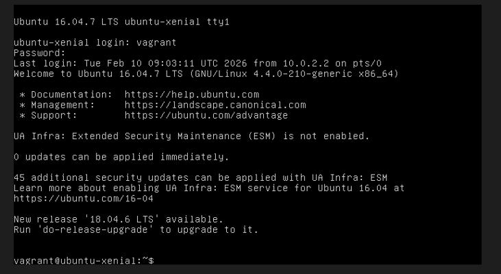

1. Zuerst müssen immer die Paketquellen von Ubuntu aktualisiert werden:
   
      ```bash
        $ sudo apt-get update
     ```  

2. Dann folgt die Installation von Apache:
   
      ```bash
        $ sudo apt-get install -y apache2
     ```  

3. Service Webanalyzer:
   
      ```bash
        $ sudo apt-get install -y webalizer 
     ```  

4. Wenn alles läuft, schauen wir uns mit <strong>$ history</strong> die gemachten Eingaben an und kopieren die relevanten Befehle in die Vagrantfile.
   
   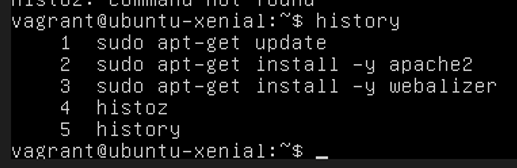

5. Folgende drei Befehle im Vagrantfile am Schluss hinzugefügt:

      ```bash
        sudo apt-get update
        sudo apt-get install -y apache2
        sudo apt-get install -y webalizer 
     ```  

   

## Feintuning

### Dateien und Port Weiterleitung

1. Erzeugung von Trafic z.B. mittels curl http://localhost/:

      ```bash
        curl http://localhost/ >/dev/null 2>&1
        curl http://localhost/ >/dev/null 2>&1
        curl http://localhost/ >/dev/null 2>&1
        curl http://localhost/ >/dev/null 2>&1
        curl http://localhost/bad >/dev/null 2>&1    
     ```  

2. Rotieren des Access Logs von Apache, weil Webanalyzer nur Archivdaten auswertet. 
   
      ```bash
        sudo logrotate -f /etc/logrotate.d/apache2    
     ```  

3. Korrektur des Output Verzeichnisses in /etc/webalizer/webalizer.conf

      ```bash
        sudo sed -i -e"s:/var/www/webalizer:/var/www/html/webalizer:" /etc/webalizer/webalizer.conf 
     ```  

4. Manuelle Erzeugung des Webanalyzer Ausgaben
   
      ```bash
        sudo /etc/cron.daily/webalizer  
     ```  

   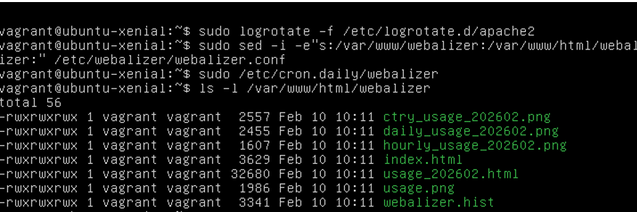

5. Das Vagrantfile sieht dann so aus:

   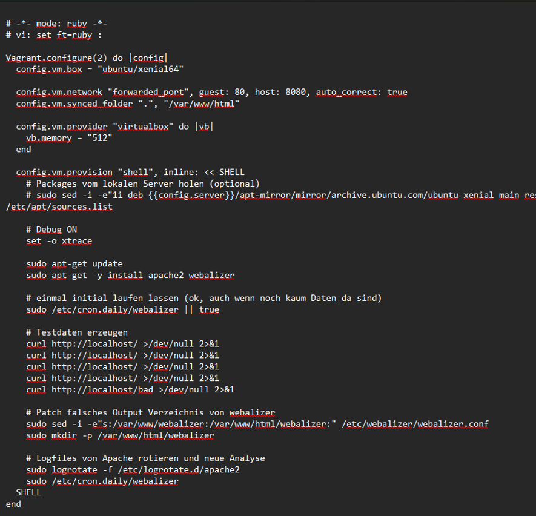

## Sicherheit

1. Die VW wurde zusätzlich mit einer Firewall abgesichert.

      ```bash
        sudo apt-get install -y ufw
        sudo ufw allow 22
        sudo ufw allow 80
        sudo 
        ufw --force enable
     ```  

---

Die virtuelle Maschine wurde zusätzlich mit der Firewall UFW abgesichert. Dabei wurden ausschliesslich die benötigten Ports 22 (SSH) und 80 (HTTP) freigegeben. 

   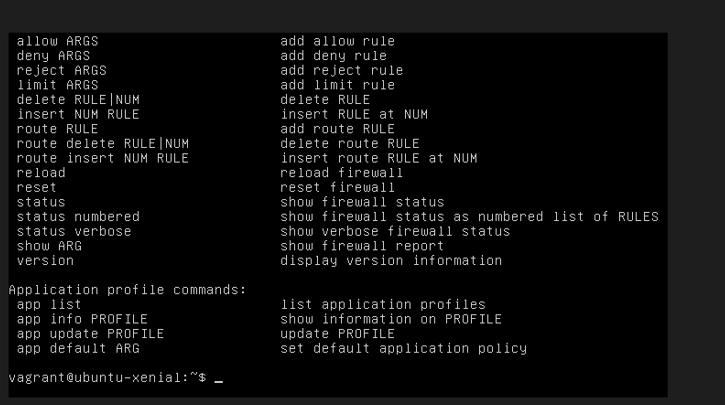
   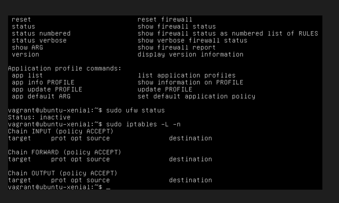

25 - Sicherheit
===================

Hier werden verschiedene Möglichkeiten aufgezeigt, wie eine virtualisierte Infrastruktur in Punkto Sicherheit verbessert werden kann.

##
Fragen: Firewall und Reverse Proxy
===

> [⇧ **Nach oben**](#inhaltsverzeichnis)

<strong>Was ist der Unterschied zwischen eineam Web Server und einem Reverse Proxy?</strong>

- Web Server handelt HTML Seiten direkt ab, Reverse Proxy dient als Stellvertretter für einen Web Server o.ä.
  
--- 

<strong>Was verstehen wir unter einer „White List“?</strong>

- Eine White List, fasst im Gegensatz zu einer Black List, Vertrauenswürdige Elemente, z.B. Server zusammen.

---

<strong>Was wäre die Alternative zum Absichern der einzelnen Server mit einer Firewall?</strong>

- Eine Zentrale Firewall

---

### SSH

<strong>Was ist der Unterschied zwischen der Datei id_rsa und id_rsa.pub?</strong>

- Private und Public Key

---

<strong>Wo darf ein SSH-Tunnel nicht angewendet werden?</strong>

- In der Firma

---

<strong>Für was dient die Datei authorized_keys?</strong>

- Beinhaltet die Public Key von allen wo ohne Password auf System dürfen

---

<strong>Für was dient die Datei known_hosts?</strong>

- Liste der Systeme wo ich mich via ssh Verbunden habe - steht nicht in Doku -> Googeln

---

##
01 - Firewall & Reverse Proxy
===

> [⇧ **Nach oben**](#inhaltsverzeichnis)

Aktuell sind alle Services ungehindert zugreifbar. Würde man eine VM direkt ins Internet oder in eine DMZ stellen, entstuende dadurch ein erhebliches Sicherheitsrisiko. Um dies zu verhindern, werden nicht-öffentliche Ports mithilfe einer Firewall gesperrt und der zulässige Datenverkehr zusätzlich über einen Reverse Proxy geschützt und verschlüsselt. So wird der Zugriff kontrolliert, unerwuenschter Traffic blockiert und die eigentlichen Zielsysteme bleiben vor direkter Erreichbarkeit geschützt.
   
## UFW Firewall

UFW steht für Uncomplicated Firewall. Ziel von UFW ist es, ein unkompliziertes Kommandozeilen-basiertes Frontend für das sehr leistungsfähige, aber nicht gerade einfach zu konfigurierende iptables zu bieten.

1. Ausgabe der offenen Ports
   
      ```bash
        $ netstat -tulpen
     ```  

2. Installation
   
      ```bash
        $ sudo apt-get install ufw
     ```  

3. Start / Stop

      ```bash
        $ sudo ufw status
        $ sudo ufw enable
        $ sudo ufw disable
     ```  

4. Firewall-Regeln (SSH & HTTP)

      ```bash
        $ sudo ufw allow 22/tcp
        $ sudo ufw status
     ```     

      ```bash
        $ sudo ufw allow 80/tcp
        $ sudo ufw allow 443/tcp
     ```     

5. Zugriff testen

      ```bash
        $ curl -I http://localhost
     ```        

6. Löschen von Regeln

      ```bash
        $ sudo ufw status numbered
        $ sudo ufw delete 1
     ``` 

7. Ausgehende Verbindungen

      ```bash
        $ sudo ufw deny out to any
        $ sudo ufw allow out 22/tcp 
     ``` 

   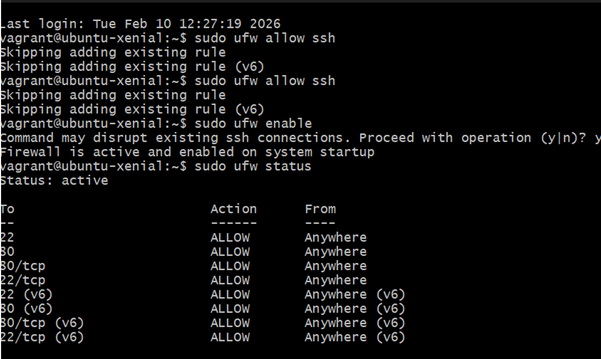

## Reverse Proxy

1. Module in Apache aktivieren

      ```bash
        $ sudo a2enmod proxy
        $ sudo a2enmod proxy_html
        $ sudo a2enmod proxy_http 
     ``` 

2. Apache-Webserver neu starten
   
      ```bash
        $ sudo service apache2 restart
     ``` 

3. Konfiguration - Die Weiterleitungen sind z.B. in sites-enabled/001-reverseproxy.conf eingetragen

      ```bash
        # Allgemeine Proxy Einstellungen
        ProxyRequests Off
        <Proxy *>
            Order deny,allow
            Allow from all
        </Proxy>

        # Weiterleitungen master
        ProxyPass /master http://master
        ProxyPassReverse /master http://master
     ``` 

   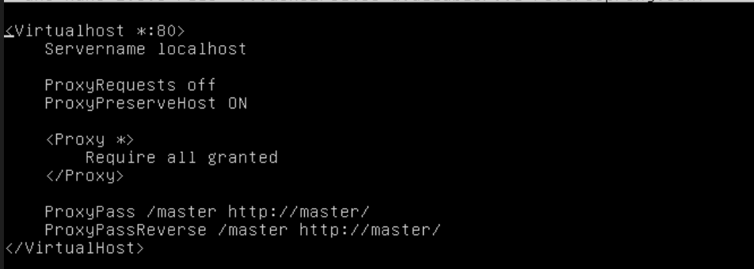

##
02 - Benutzer- & Rechteverwaltung
===

> [⇧ **Nach oben**](#inhaltsverzeichnis)

Linux ist ein Multiuser-Betriebssystem, bei dem mehrere Benutzer mit unterschiedlichen Rechten auf einem System arbeiten können. Neben normalen Benutzern gibt es auch Systembenutzer wie www-data für Dienste, um Sicherheit und Isolation zu gewährleisten. Der Benutzer root besitzt alle Rechte, administrative Aufgaben werden normalerweise mit <strong>sudo</strong> ausgeführt.

Das Linux-Dateisystem basiert auf einem hierarchischen Aufbau und verwendet ein Rechtekonzept mit drei Ebenen:

- Eigentümer (user)
- Gruppe (group)
- Andere (others)

Für jede dieser Ebenen können drei Rechte vergeben werden:

- r (read – lesen)
- w (write – schreiben)
- x (execute – ausführen)

Zusätzlich existieren Sonderrechte wie SUID, SGID und das Sticky-Bit, die erweiterte Sicherheitsfunktionen ermöglichen.

Die Verwaltung der Rechte erfolgt mit den Befehlen:

- chmod (Rechte ändern)
- chown (Besitzer ändern)
- chgrp (Gruppe ändern)

Dieses Berechtigungssystem stellt sicher, dass Benutzer nur auf die Ressourcen zugreifen können, für die sie autorisiert sind, und bildet eine zentrale Grundlage für die Systemsicherheit unter Linux.


##
03 – SSH
===

> [⇧ **Nach oben**](#inhaltsverzeichnis)

Im Rahmen der Aufgabe wurde für die VM ein neuer Benutzer eingerichtet und die SSH-Authentifizierung mittels Public-Key-Verfahren konfiguriert.

## Public Key Verfahren

1. Der Benutzer admin01 wurde erstellt und der sudo-Gruppe hinzugefügt, damit administrative Befehle ausgeführt werden können.

      ```bash
        sudo adduser admin01
        sudo usermod -aG sudo admin01
        sudo su - admin01
     ``` 

2. Für den Benutzer admin01 wurde ein 4096-Bit RSA-Schlüsselpaar erzeugt.


      ```bash
        ~/.ssh/id_rsa (privater Schlüssel)
        ~/.ssh/id_rsa.pub (öffentlicher Schlüssel)
     ``` 

3. Public Key hinterlegen

      ```bash
        mkdir -p ~/.ssh
        chmod 700 ~/.ssh
        cat ~/.ssh/id_rsa.pub >> ~/.ssh/authorized_keys
        chmod 600 ~/.ssh/authorized_keys
     ``` 

Der öffentliche Schlüssel wurde in die Datei authorized_keys eingetragen.

Die Verzeichnis- und Dateirechte wurden korrekt gesetzt:

.ssh → 700

authorized_keys → 600

1. Funktionstest (Public-Key Login)

      ```bash
        ssh -o PreferredAuthentications=publickey -o PasswordAuthentication=no admin01@localhost "whoami && hostname"
     ```

Der Login erfolgte erfolgreich ohne Passwortabfrage.
Damit wurde bestätigt, dass die Authentifizierung mittels Public-Key korrekt funktioniert.

2. Zusätzlich wurde die Rechtevergabe überprüft:

      ```bash
        ls -ld ~/.ssh
        ls -l ~/.ssh/authorized_keys
     ```

## SSH-Tunnel (Local Port Forwarding)

1. Es wurde ein lokaler SSH-Tunnel innerhalb der VM erstellt.

      ```bash
        ssh -L 9000:localhost:22 localhost -N &
     ```

### Erklärung:

- Port 9000 → lokaler Port
- localhost:22 → Weiterleitung auf den lokalen SSH-Port
- -N → keine Shell starten
- & → Prozess im Hintergrund starten

---

2. Tunnel prüfen

      ```bash
        netstat -tulpen | grep 9000
     ```

Damit wurde bestätigt, dass Port 9000 lokal weitergeleitet wird.

##
04 - Authentifizierung & Autorisierung
===

> [⇧ **Nach oben**](#inhaltsverzeichnis)

Authentifizierung bedeutet, dass ein Benutzer seine Identität nachweist, z.B. durch ein Passwort oder einen SSH-Key. Erst wenn dieser Identitätsnachweis erfolgreich ist, gilt der Benutzer als authentisch.

Autorisierung erfolgt nach der erfolgreichen Authentifizierung. Dabei wird geprüft, welche Rechte der Benutzer besitzt und auf welche Ressourcen er zugreifen darf (z.B. Dateien, Verzeichnisse oder Dienste).

Im Webserver-Bereich kann der Zugriff zusätzlich abgesichert werden, z.B. durch:

- HTTPS (verschlüsselte Verbindung)
- Benutzer-/Passwort-Abfrage (.htpasswd)
- LDAP-Anbindung zur zentralen Benutzerverwaltung

LDAP dient dabei als Verzeichnisdienst, über den Benutzerinformationen zentral gespeichert und abgefragt werden können.

Im Unternehmensumfeld werden diese Prozesse im Rahmen des Identity and Access Management (IAM) verwaltet. Ziel ist es, Identitäten sicher zu verwalten und Benutzern nur die benötigten Rechte zuzuweisen.

30 - Container
===================

##
Fragen - Container
===

> [⇧ **Nach oben**](#inhaltsverzeichnis)

<strong>Was ist der Unterschied zwischen Vagrant und Docker?</strong>

- Vagrant ist für IaaS (Virtuelle Maschinen) und Docker für PaaS bzw. CaaS (Container)

--- 

<strong>Was welches Tools aus dem Docker Universum ist Vergleichbar mit Vagrant?</strong>

- docker machine

---

<strong>Was macht der Docker Provisioner von Vagrant?</strong>

- Installiert Docker in einer VM

---

<strong>Welche Linux Kernel Funktionalität verwenden Container?</strong>

- Linux Namespaces, siehe auch [The Missing Introduction To Containerization]

---

<strong>Welches Architekturmuster verwendet der Entwickler wenn er Container einsetzt?</strong>

- Microservices

---

<strong>Welches sind die drei Hauptmerkmale (abgeleitet vom Ur-Unix) von Microservices?</strong>

- Ein Programm soll nur eine Aufgabe erledigen, und das soll es gut machen. Programme sollen zusammenarbeiten können. Nutze eine universelle Schnittstelle. In UNIX sind das Textströme. Bei Microservices das Internet (REST).

---

### Docker

<strong>Was ist der Unterschied zwischen einem Docker Image und einem Container?</strong>

- Image = gebuildet und readonly, Container Image + aktuelle Änderungen im Filesystem

---

<strong>Was ist der Unterschied zwischen einer Virtuellen Maschine und einem Docker Container?</strong>

- VM hat Betriebssystem mit am laufen, Docker nur die eigenen Prozesse

---

<strong>Was ist der Unterschied zwischen einem Docker Image und einem Container?</strong>

- Image = gebuildet und readonly, Container Image + aktuelle Änderungen im Filesystem

---

<strong>Wie bekomme ich Informationen zu einem laufenden Docker Container?</strong>

- docker logs, docker inspect

---

<strong>Was ist der Unterschied zwischen einer Docker Registry und einem Repository</strong>

- In der Docker Registry werden die Container Images gespeichert. Ein Repository speichert pro Container Image verschiedene Versionen von Images.

---

<strong>Wie erstelle ich ein Container Image</strong>

- docker build

---

<strong>In welcher Datei steht welche Inhalte sich im Container Image befinden?</strong>

- Dockerfile

---

<strong>Der erste Prozess im Container bekommt die Nummer?</strong>

- 1

---

### Docker Hub

<strong>Was ist Docker Hub?</strong>

- Ein Container Registry, wo Container Image gespeichert werden. Docker Hub wird durch die Firma Docker zur Verfügung gestellt wird.

---

<strong>Welches sind die Alternativen?</strong>

- Praktisch jeder Cloud Anbieter stellt eine Container Registry zur Verfügung. Auch die Anbieter für die Verwaltung von Build Artefakten (z.B. Sonatype Nexus) stellen Docker Registries zur Verfügung oder haben deren Funktionalität integriert.

---

<strong>Warum sollte eine eigene Docker Registry im Unternehmen verwendet werden?</strong>

- Sicherheit, bzw. das mögliche Fehlen davon. Es kann nicht Sichergestellt werden, dass alle Container Images auf Docker Hub sicher sind.

---

<strong>Warum sollten Versionen tag von Images immer angegeben werden?

</strong>

- Ansonsten wird `latest` verwendet und so nicht sicher welche Version wirklich verwendet wird.

---

<strong>Was ist der Unterschied zwischen `docker save`/`docker load` und `docker export`/`docker import`?

</strong>

- `save/load` ist für Images, `export/import` für Container. So ist es möglich auch ohne Docker Registry Container Images auszutauschen, z.B. in einer Bank.

---

##
LB3 hands-on
===

> [⇧ **Nach oben**](#inhaltsverzeichnis)

---------------------------------------- MUSS ERGÄNZT WERDEN!

## 
01 - Container
===

> [⇧ **Nach oben**](#inhaltsverzeichnis)

Container verändern grundlegend, wie Software entwickelt, bereitgestellt und betrieben wird. Sie ermöglichen es, Anwendungen inklusive aller Abhängigkeiten in einer isolierten Umgebung zu verpacken. Dadurch läuft die Software überall identisch – unabhängig davon, ob sie lokal, im Rechenzentrum oder in der Cloud betrieben wird.

Ein zentraler Vorteil von Containern ist die Portabilität. Anwendungen können einmal entwickelt und anschliessend auf verschiedenen Systemen ohne Anpassungen ausgeführt werden. Dadurch entfallen typische Probleme wie unterschiedliche Systemkonfigurationen oder fehlende Abhängigkeiten.

### Wichtige Merkmale von Containern

- Container teilen sich den Kernel des Host-Betriebssystems
- Sehr schneller Start und Stopp (Sekundenbereich)
- Geringer Ressourcenverbrauch (leichtgewichtig)
- Hohe Portabilität
- Mehrere Container können parallel betrieben werden
- Ideal für Cloud-Umgebungen

Im Gegensatz zu virtuellen Maschinen benötigen Container kein eigenes vollständiges Betriebssystem, wodurch sie effizienter und ressourcenschonender sind.

### Container von Microservices

Ein wichtiger Anwendungsbereich von Containern ist die Microservices-Architektur.

Während klassische Software oft als Monolith aufgebaut ist (eine grosse, zusammenhängende Anwendung), bestehen Microservices aus mehreren kleinen, unabhängigen Diensten, die über das Netzwerk miteinander kommunizieren.

- Vorteile von Microservices:
- Horizontale Skalierung (scale out)
- Nur einzelne Services müssen bei Bedarf skaliert werden
- Bessere Ressourcennutzung
- Höhere Flexibilität

Container eignen sich ideal für Microservices, da jeder Service isoliert in einem eigenen Container betrieben werden kann.

## 
02 - Docker
===

> [⇧ **Nach oben**](#inhaltsverzeichnis)

Docker ist eine Container-Plattform, mit der Anwendungen inklusive aller Abhängigkeiten isoliert ausgeführt werden können. Dadurch läuft Software überall identisch – unabhängig vom System.

Docker besteht aus:

- Docker Daemon → Führt Container aus
- Docker Client (CLI) → Steuert Docker per Kommandozeile
- Images → Unveränderbare Vorlagen für Container
- Container → Laufende Instanzen von Images
- Docker Registry (Docker Hub) → Speicherort für Image

Ein Image ist eine Vorlage, ein Container ist die laufende Instanz dieses Images.

Docker nutzt sogenannte Layer (Imageschichten). Jede Anweisung im Dockerfile erzeugt eine neue Schicht.

## Docker Architektur

Docker funktioniert nach dem Client-Server-Prinzip:

- CLI → Docker Daemon → Container

Images werden lokal gespeichert oder vom Docker Hub heruntergeladen.


## Befehle


-------------

35 - Sicherheit
===================

> [⇧ **Nach oben**](#inhaltsverzeichnis)


40 - Kubernetes (K8s)
===================

> [⇧ **Nach oben**](#inhaltsverzeichnis)


50 - Projekte
===================

Ziel dieses Projektes war es, eine funktionierende Git-Plattform mit Docker bereitzustellen.

##
01 - Docker Projekt – Gitea Git Server
===

> [⇧ **Nach oben**](#inhaltsverzeichnis)

## Zweck des gewählten Service

Gitea ist ein leichtgewichtiger, selbst gehosteter Git-Server. Er ermöglicht die zentrale Verwaltung von Repositories, Benutzern und Versionen, ähnlich wie GitHub oder GitLab, jedoch lokbegriffal im eigenen Netzwerk.

## Aufbau / Logische Struktur

Das Projekt wurde mit Docker Compose umgesetzt und besteht aus zwei Containern:

- `gitea` → Weboberfläche + Git SSH Server
- `postgres` → Datenbank für Benutzer, Repositories und Einstellungen

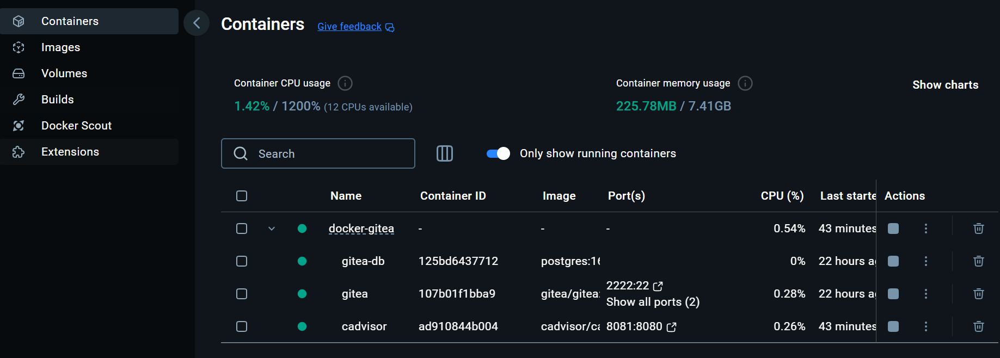

### Netzwerk

Docker Compose erstellt automatisch ein internes Netzwerk.

- Der Datenbank-Container ist für Gitea über den Hostnamen `db:5432` erreichbar.

### Persistenz (Volumes)

- <strong>gitea-data</strong> → speichert Repositories und Konfiguration
- <strong>postgres-data</strong> → speichert Datenbankdaten

Damit bleiben alle Daten auch nach einem Neustart erhalten.

## Projektordner erstellen & Konfiguration des Dienstes

1. Projektordner lokal anlegen 

      ```bash
        mkdir docker-gitea
        cd docker-gitea
     ```

2. Eine Datei docker-compose.yml mit folgendem Inhalt erstellen:

      ```bash
        touch docker-compose.yml
     ```

3. Datei öffnen und folgenden Inhalt hinzufügen:

      ```bash
          services:
            db:
              image: postgres:16
              container_name: gitea-db
              environment:
                - POSTGRES_USER=gitea
                - POSTGRES_PASSWORD=gitea_pw
                - POSTGRES_DB=gitea
              volumes:
                - postgres-data:/var/lib/postgresql/data
              restart: unless-stopped

            gitea:
              image: gitea/gitea:latest
              container_name: gitea
              depends_on:
                - db
              environment:
                - GITEA__database__DB_TYPE=postgres
                - GITEA__database__HOST=db:5432
                - GITEA__database__NAME=gitea
                - GITEA__database__USER=gitea
                - GITEA__database__PASSWD=gitea_pw
              ports:
                - "3000:3000"
                - "2222:22"
              volumes:
                - gitea-data:/data
              restart: unless-stopped

          volumes:
            gitea-data:
            postgres-data:
     ```

4. Container wurden gestartet mit:

      ```bash
        docker compose up -d
     ```

5. Ansicht von den erstellten Containern:


## Netzwerk & Ports

Folgende Ports werden benötigt:

| Port                    | Zugriff                                                      |
| ------------------------- | ----------------------------------------------------------------- | 
| `3000`            | Weboberfläche |
| `2222`              |  SSH Git Zugriff |

### Webzugriff:

http://localhost:3000

### SSH Zugriff:

      ```bash
        ssh -p 2222 git@localhost
     ```

## Host ↔ Container Interaktion (Volumes)

1. Volumes wurden verwendet, um Persistenz sicherzustellen:

      ```bash
        docker volume ls
        docker volume inspect gitea-data
     ```

2. Nach einem Neustart:

      ```bash
        docker compose restart
     ```


    waren alle Repositories weiterhin vorhanden.
    Damit wurde die korrekte Volume-Konfiguration bestätigt.

## Monitoring Lösung

Zur Überwachung wurden folgende Docker-Tools eingesetzt:

1. Container Status:
   
      ```bash
        docker compose ps
     ```

2. Logs prüfen:

      ```bash
        docker logs gitea --tail 50
     ```

3. Ressourcen überwachen:

      ```bash
        docker stats
     ```

4. Web-Erreichbarkeit testen:

      ```bash
        curl http://localhost:3000
     ```

### Externes Monitoring mit cAdvisor

Zusätzlich wurde cAdvisor als Monitoring-Tool in Docker Compose integriert.

cAdvisor stellt eine Weboberfläche zur Verfügung, in der folgende Metriken überwacht werden können:

- CPU-Auslastung
- Arbeitsspeicherverbrauch
- Netzwerk-Traffic
- Dateisystem-Nutzung
- Container-Laufzeit

1. Erweiterung der docker-compose.yml:
   
      ```bash
        cadvisor:
          image: gcr.io/cadvisor/cadvisor:latest
          container_name: cadvisor
          ports:
            - "8081:8080"
          volumes:
            - /:/rootfs:ro
            - /var/run:/var/run:ro
            - /sys:/sys:ro
            - /var/lib/docker/:/var/lib/docker:ro
          restart: unless-stopped
     ```

2. Container neu starten nach der Anpassung:
   
      ```bash
        docker compose up -d
     ```

3. Zugriff erfolgt über:

      ```bash
        http://localhost:8081
     ```


## 
02 - Aufgetretene Fehler & Lösungen
===

> [⇧ **Nach oben**](#inhaltsverzeichnis)

## Fehler 1 – HTTP 405 Method Not Allowed

1. Beim Test mit:

      ```bash
        curl -I http://localhost:3000
     ```

    erschien: 
    
    HTTP/1.1 405 Method Not Allowed
    
### Ursache:

    `-I` sendet eine HEAD-Anfrage. Gitea erlaubt nur GET und POST.

### Lösung:

1. Test mit normalem GET:

    ```bash
        curl -I http://localhost:3000
     ```
    Danach funktionierte der Zugriff korrekt.

## Fehler 2 – SSH Verbindung funktionierte nicht

Initial kam beim SSH-Test:

- Permission denied (publickey)

### Ursache:

- Kein SSH-Key hinterlegt.

### Lösung:

1. SSH-Key erstellen:

    ```bash
      ssh-keygen -t ed25519
     ```

2. Public Key anzeigen:

    ```bash
      cat ~/.ssh/id_ed25519.pub
     ```

3. In Gitea unter:

  - Profile → Settings → SSH Keys

    hinzufügen.

4. Danach funktionierte:

    ```bash
      ssh -p 2222 git@localhost
     ```

## Fehler 3 – Unsicherheit bei Datenbank Konfiguration

Im Setup-Screen war unklar, ob Werte geändert werden müssen.

### Lösung:

Die Docker Compose ENV Variablen wurden übernommen:

| Feld                    | Wert                                                      |
| ------------------------- | ----------------------------------------------------------------- | 
| `Host`            | db:5432 |
| `Username`              |  gitea |
| `Password`            | gitea_.. |
| `Database`              |  gitea |

Installation lief danach fehlerfrei.

##
Funktionstest
===

1. Repository wurde erstellt:

    ```bash
      test-repo
     ```

2. Clone via SSH:

    ```bash
      git clone ssh://git@localhost:2222/gitea/test-repo.git
     ```

3. Commit & Push:

    ```bash
      git add .
      git commit -m "Initial commit"
      git push
     ```

4. Commit & Push - Erweitert:

    ```bash
      git add README.md
      git commit -m "README erweitert"
      git push
     ```

Im Webinterface war der Commit sichtbar.
Damit wurde die vollständige Funktionsfähigkeit bestätigt.

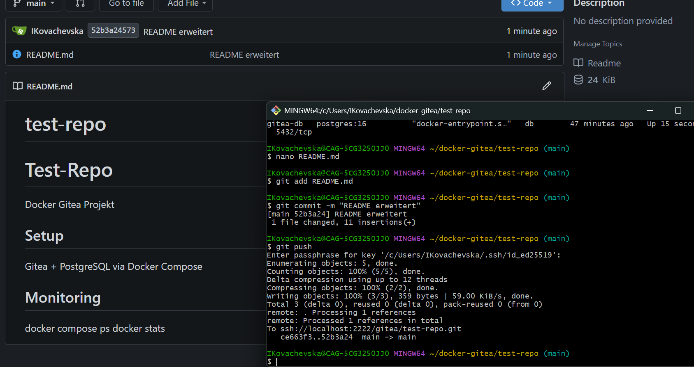
