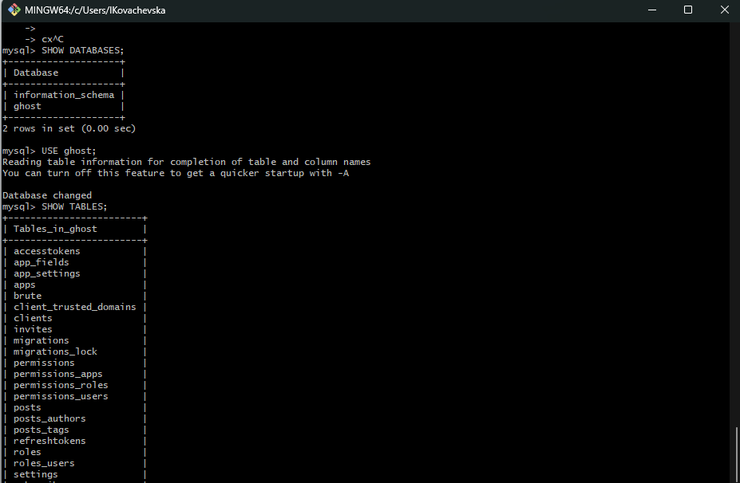
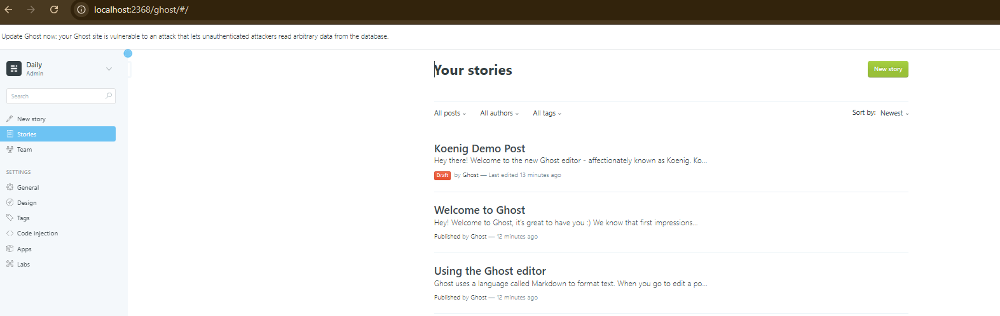
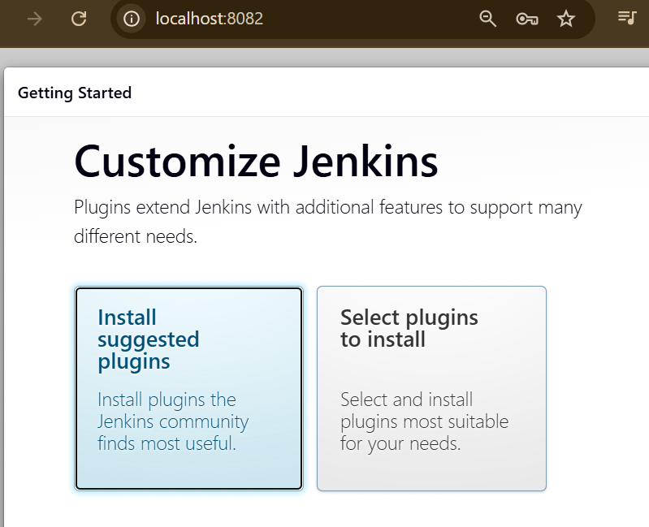
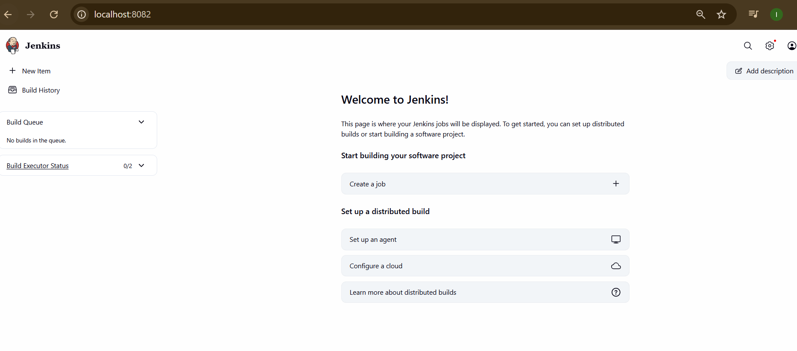

## M300-Plattformübergreifende-Dienste-in-ein-Netzwerk-integrieren
Toolumgebung für Modul 300

Git Hub,Git Bash, Virtualbox, Vagrant & Apache

#### Inhaltsverzeichnis

<!-- TOC -->

- [10 - Toolumgebung aufsetzen](#10---toolumgebung-aufsetzen)
  - [01 - GitHub Account](#01---github-account)
    - [Account erstellen](#account-erstellen)
    - [Repository erstellen](#repository-erstellen)
    - [SSH-Key erstellen und dem SSH-Agent hinzufügen](#ssh-key-erstellen-und-dem-ssh-agent-hinzufügen)
  - [02 - Git Client](#02---git-client)
    - [Repository klonen](#repository-klonen)
    - [Repository herunterladen \& aktualisieren (clone/pull)](#repository-herunterladen--aktualisieren-clonepull)
  - [03 - VirtualBox](#03---virtualbox)
    - [VM erstellen](#vm-erstellen)
    - [VM einrichten](#vm-einrichten)
  - [04 - Vagrant](#04---vagrant)
    - [Virtuelle Maschine erstellen](#virtuelle-maschine-erstellen)
    - [Apache Webserver automatisiert aufsetzen](#apache-webserver-automatisiert-aufsetzen)
  - [05 - Visual Studio Code](#05---visual-studio-code)
    - [Extensions installieren](#extensions-installieren)
    - [Einstellungen anpassen](#einstellungen-anpassen)
    - [Repository hinzufügen \& pushen](#repository-hinzufügen--pushen)
- [20 - Infrastruktur-Automatisierung](#20---infrastruktur-automatisierung)
  - [01 - Cloud Computing](#01---cloud-computing)
    - [Arten von Cloud Computing](#arten-von-cloud-computing)
  - [02 - Infrastructure as Code (IaC)](#02---infrastructure-as-code-iac)
  - [03 - Vagrant](#03---vagrant)
    - [Funktionsweise \& Konzepte](#funktionsweise--konzepte)
    - [Boxen / Konfiguration / Provisioning / Provider](#boxen--konfiguration--provisioning--provider)
    - [Ergänzung](#ergänzung)
    - [Workflow](#workflow)
    - [Box hinzufügen](#box-hinzufügen)
    - [VM erstellen](#vm-erstellen-1)
    - [VM updaten](#vm-updaten)
    - [VM löschen](#vm-löschen)
    - [Synced Folders (Gemeinsame Ordner)](#synced-folders-gemeinsame-ordner)
    - [Ergänzung](#ergänzung-1)
  - [04 - Packer](#04---packer)
  - [05 - AWS Cloud](#05---aws-cloud)
    - [Vagrant](#vagrant)
  - [LB2 hands-on](#lb2-hands-on)
    - [Neue VM zum Testen erstellen](#neue-vm-zum-testen-erstellen)
    - [Serverdienste auswählen](#serverdienste-auswählen)
    - [Feintuning](#feintuning)
    - [Dateien und Port Weiterleitung](#dateien-und-port-weiterleitung)
    - [Sicherheit](#sicherheit)
- [25 - Sicherheit](#25---sicherheit)
  - [01 - Firewall \& Reverse Proxy](#01---firewall--reverse-proxy)
    - [UFW Firewall](#ufw-firewall)
    - [Reverse Proxy](#reverse-proxy)
  - [02 - Benutzer- \& Rechteverwaltung](#02---benutzer---rechteverwaltung)
  - [03 – SSH](#03--ssh)
    - [Public Key Verfahren](#public-key-verfahren)
    - [SSH-Tunnel (Local Port Forwarding)](#ssh-tunnel-local-port-forwarding)
    - [Erklärung:](#erklärung)
  - [04 - Authentifizierung \& Autorisierung](#04---authentifizierung--autorisierung)
- [30 - Container](#30---container)
  - [LB3 hands-on](#lb3-hands-on)
    - [Ziel - Docker Frontend \& Backend Kombination](#ziel---docker-frontend--backend-kombination)
    - [Docker Umgebung](#docker-umgebung)
    - [Docker Netzwerk erstellen](#docker-netzwerk-erstellen)
    - [Backend (MySQL) starten](#backend-mysql-starten)
    - [Frontend (Ghost) starten](#frontend-ghost-starten)
    - [Zugriff über Browser](#zugriff-über-browser)
    - [Kommunikation zwischen Containern](#kommunikation-zwischen-containern)
    - [Persistenz (Volume)](#persistenz-volume)
    - [Fazit](#fazit)
  - [01 - Container](#01---container)
    - [Wichtige Merkmale von Containern](#wichtige-merkmale-von-containern)
    - [Container von Microservices](#container-von-microservices)
  - [02 - Docker](#02---docker)
    - [Docker Architektur](#docker-architektur)
    - [Befehle](#befehle)
    - [Docker Images](#docker-images)
    - [MySQL Container](#mysql-container)
  - [Fehler und Lösungen](#fehler-und-lösungen)
    - [Fehler 1 – Git Bash /bin/bash Problem](#fehler-1--git-bash-binbash-problem)
      - [Ursache](#ursache)
      - [Lösung](#lösung)
    - [Fehler 2 – MySQL Container beendet sich sofort](#fehler-2--mysql-container-beendet-sich-sofort)
      - [Ursache](#ursache-1)
      - [Lösung](#lösung-1)
  - [03 - Netzwerk - Anbindung](#03---netzwerk---anbindung)
    - [Ports veröffentlichen](#ports-veröffentlichen)
    - [Port im Dockerfile deklarieren](#port-im-dockerfile-deklarieren)
    - [Zugriff vom Host ermöglichen (MySQL Beispiel)](#zugriff-vom-host-ermöglichen-mysql-beispiel)
    - [Container Networking](#container-networking)
      - [Standard-Netzwerke](#standard-netzwerke)
  - [04 - Volumes](#04---volumes)
    - [Warum Volumes?](#warum-volumes)
    - [Volume im Dockerfile deklarieren](#volume-im-dockerfile-deklarieren)
    - [Named Volumes erstellen](#named-volumes-erstellen)
    - [Bind-Mount (Host-Verzeichnis einhängen)](#bind-mount-host-verzeichnis-einhängen)
    - [Volume im Container testen](#volume-im-container-testen)
    - [Datencontainer (veraltet)](#datencontainer-veraltet)
  - [05 – Image-Bereitstellung](#05--image-bereitstellung)
    - [Namensgebung und Tags](#namensgebung-und-tags)
    - [Docker Hub verwenden](#docker-hub-verwenden)
    - [Images exportieren und importieren](#images-exportieren-und-importieren)
    - [Container exportieren und importieren](#container-exportieren-und-importieren)
    - [Private Registry betreiben](#private-registry-betreiben)
- [35 - Sicherheit](#35---sicherheit)
  - [01 - Protokollieren \& Überwachen](#01---protokollieren--überwachen)
    - [Logging](#logging)
    - [Monitoring](#monitoring)
  - [02 - Container sichern \& beschränken](#02---container-sichern--beschränken)
    - [Wichtige Risiken](#wichtige-risiken)
    - [Wichtige Sicherheitsmassnahmen](#wichtige-sicherheitsmassnahmen)
      - [Wichtiger Hinweis](#wichtiger-hinweis)
  - [03 - Kontinuierliche Integration (CI)](#03---kontinuierliche-integration-ci)
    - [Jenkins \& Blue Ocean](#jenkins--blue-ocean)
      - [Jenkins Einrichtung](#jenkins-einrichtung)
      - [Überprüfung der gebauten Images](#überprüfung-der-gebauten-images)
      - [Anwendung testen](#anwendung-testen)
    - [Ziele](#ziele)
    - [Zusammenhang zur Sicherheit](#zusammenhang-zur-sicherheit)
  - [Ergebnis](#ergebnis)
  - [Fazit](#fazit-1)
- [40 - Kubernetes (K8s)](#40---kubernetes-k8s)
  - [01 - Grundbegriffe](#01---grundbegriffe)
    - [Service Discovery](#service-discovery)
    - [Vernetzung (Container Networking)](#vernetzung-container-networking)
    - [Lastverteilung (Load Balancing)](#lastverteilung-load-balancing)
    - [Cluster](#cluster)
  - [02 – Kubernetes](#02--kubernetes)
    - [Wichtige Eigenschaften](#wichtige-eigenschaften)
    - [Wichtige Kubernetes-Objekte](#wichtige-kubernetes-objekte)
    - [Gesamtzusammenfassung](#gesamtzusammenfassung)
  - [03 - Kubernetes hands-on](#03---kubernetes-hands-on)
    - [Wichtige Konzepte:](#wichtige-konzepte)
- [50 - Projekte](#50---projekte)
  - [01 - Docker Projekt – Gitea Git Server](#01---docker-projekt--gitea-git-server)
    - [Zweck des gewählten Service](#zweck-des-gewählten-service)
    - [Aufbau / Logische Struktur](#aufbau--logische-struktur)
    - [Netzwerk](#netzwerk)
    - [Persistenz (Volumes)](#persistenz-volumes)
    - [Projektordner erstellen \& Konfiguration des Dienstes](#projektordner-erstellen--konfiguration-des-dienstes)
    - [Netzwerk \& Ports](#netzwerk--ports)
    - [Webzugriff](#webzugriff)
    - [SSH Zugriff](#ssh-zugriff)
    - [Host ↔ Container Interaktion (Volumes)](#host--container-interaktion-volumes)
    - [Monitoring Lösung](#monitoring-lösung)
    - [Externes Monitoring mit cAdvisor](#externes-monitoring-mit-cadvisor)
  - [02 - Aufgetretene Fehler \& Lösungen](#02---aufgetretene-fehler--lösungen)
    - [Fehler 1 – HTTP 405 Method Not Allowed](#fehler-1--http-405-method-not-allowed)
      - [Ursache](#ursache-2)
      - [Lösung](#lösung-2)
    - [Fehler 2 – SSH Verbindung funktionierte nicht](#fehler-2--ssh-verbindung-funktionierte-nicht)
      - [Ursache](#ursache-3)
      - [Lösung](#lösung-3)
    - [Fehler 3 – Unsicherheit bei Datenbank Konfiguration](#fehler-3--unsicherheit-bei-datenbank-konfiguration)
      - [Lösung](#lösung-4)
  - [03 - Funktionstest](#03---funktionstest)

<!-- /TOC -->


10 - Toolumgebung aufsetzen
===================

Hier wird die Installation von GitHub, VirtualBox, Vagrant und Visual Studio Code durchgeführt.


## 01 - GitHub Account

> [⇧ **Nach oben**](#inhaltsverzeichnis)

### Account erstellen

Zunächst wurde ein GitHub-Account auf https://www.github.com erstellt.

Folgende Angaben wurden gemacht:

- Benutzername: IKovachevska
- E-Mail-Adresse: kovacevskai11@gmail.com
- Passwort: ...

Nach der Registrierung wurde die E-Mail zur Verifizierung des Kontos bestätigt und anschliessend auf GitHub angemeldet.

### Repository erstellen

Nach der Anmeldung wurde ein neues Repository <strong>M300 -Services</strong> erstellt.

Vorgehen:

1. Klick auf **Start a project**
2. Repository Name: `M300-Services`
3. Sichtbarkeit: **Public**
4. Option **Initialize this repository with a README** aktiviert
5. Klick auf **Create repository**

Das Repository wurde erfolgreich erstellt.

### SSH-Key erstellen und dem SSH-Agent hinzufügen

Vorgehen

1.  Terminal (*Bash*) öffnen
2.  Folgenden Befehl mit der Account-E-Mail von GitHub einfügen:
    ```Shell
      $  ssh-keygen -t rsa -b 4096 -C "kovacevskai11@gmail.com"
    ```
3. Neuer SSH-Key wird erstellt.

4. Bei der Abfrage, unter welchem Namen der Schlüssel gespeichert werden soll, die Enter-Taste drücken (für Standard):
    ```Shell
      Enter a file in which to save the key (~/.ssh/id_rsa): [Press enter]
    ```
5. Nun kann ein Passwort für den Key festgelegt werden. 
    ```Shell
      Enter passphrase (empty for no passphrase): [Passwort]
      Enter same passphrase again: [Passwort wiederholen]
    ```


1. Auf Benutzerkonto klicken (oben rechts) und den Punkt <strong>Settings</strong> aufrufen
2. Unter den Menübereichen auf der linken Seite zum Abschnitt <strong>SSH und GPG keys</strong> wechseln
3.  Auf <strong>New SSH key</strong> klicken
4.  Im Formular unter <strong>Title</strong> eine Bezeichnung vergeben (MB SSH-Key)
5.  Den zuvor kopierten Key mit <i>CTRL + V</i> einfügen und auf <strong>Add SSH key</strong> klicken
6.  Der SSH-Key wurde erfolgreich hinzugefügt.


## 02 - Git Client

> [⇧ **Nach oben**](#inhaltsverzeichnis)

1. Git Client installiert und befähigt.
2. Client wie folgt konfiguriert:

    ```Shell
      $ git config --global user.name "<IKovachevska>"
    ```

    ```Shell
      $ git config --global user.email "<kovacevskai11@gmail.com>"
    ```

### Repository klonen

1. Repository mit SSH klonen:

    ```Shell
      $ git clone https://gitlab.com/ch-tbz-it/Stud/m300/m300
      $ cd M300-Services
      $ git pull
      $ git status
    ```

2. Ergebnis:


### Repository herunterladen & aktualisieren (clone/pull)

1. Ordner für Repository im gewünschten Verzeichnis erstellen, Repository mit SSH klonen und aktualisieren:

    ```Shell
      $ mkdir MeinLokalesRepository
      $ cd M300
      $ git clone git@github.com:IKovachevska/M300-Services.git
      $ git pull
    ```


## 03 - VirtualBox

> [⇧ **Nach oben**](#inhaltsverzeichnis)

VirtualBox wurde von der offiziellen Webseite heruntergeladen und installiert.

### VM erstellen

Neue VM erstellt mit folgenden Einstellungen:

- Name: M300_Ubuntu_22.04_Desktop
- Typ: Linux
- Version: Ubuntu (64-bit)
- RAM: 2048 MB
- CPU: 2 Kerne
- Festplatte: 25 GB
- Typ: VMDK
- Dynamisch alloziert

### VM einrichten

1. Ubuntu-VM starten
   
2. Terminal (Bash) öffnen
   
3. Paketliste neu einlesen und Pakete aktualisieren:

    ```bash
      $ sudo apt-get update   
      $ sudo apt-get upgrade   
      $ sudo reboot     
    ```

4. Software Controlcenter "Synaptic" installieren:
   
    ```bash
      $ sudo apt-get install synaptic     
    ```

5. Apache installieren:

    ```bash
      $ sudo apt-get install apache2
    ```

6. System-Neustart durchführen:

    ```bash
      $ sudo reboot
    ```

Test im Browser:

```
http://127.0.0.1
```

Apache-Standardseite wurde angezeigt.


## 04 - Vagrant

> [⇧ **Nach oben**](#inhaltsverzeichnis)

Die Software installiert und befähigt.

### Virtuelle Maschine erstellen

1. In dem gewünschten Verzeichnis einen neuen Ordner für die VM angelegt:

     ```bash
       $ cd C:\Users\IKovachevska\M-300
       $ mkdir MeineVagrantVM
       $ cd MeineVagrantVM
     ```

2. Vagrantfile erzeugt, VM erstellt und entsprechend gestartet:    

      ```bash
       $ vagrant init ubuntu/xenial64        
       $ vagrant up --provider virtualbox    
     ```   

    

3. Die VM ist nun in Betrieb und kann via SSH-Zugriff bedient werden:

      ```bash
       $ cd C:\Users\IKovachevska\M-300\MeineVagrantVM         
       $ vagrant ssh  

       $ ls -l /bin
	   $ df -h 
	   $ free -m   
     ```   

### Apache Webserver automatisiert aufsetzen

1. In das M300-Verzeichnis wechseln:

      ```bash
       $ cd C:/Users/IKovachevska/m300/vagrant/web
     ```   

2. VM erstellen und starten:

      ```bash
       $ vagrant up
     ```   

3. Webbrowser in der VM öffnen http://127.0.0.1:8080 und prüfen ob das erreichbar ist.

4. Im Ordner /web die Hauptseite index.html editieren bzw. durch eine andere ersetzen (z.B. HTML5up-Themplate) und das Resultat überprüfen:
   
    

5. VM anschlissend mit folgendem Befehl gelöscht:
   
      ```bash
       $ vagrant destroy -f
     ```   


## 05 - Visual Studio Code

> [⇧ **Nach oben**](#inhaltsverzeichnis)

Die Software war bereits installiert und einsatzfähig.

### Extensions installieren

Benötigte Extensions installiert:

- Markdown All in One (von Yu Zhang)
- Vagrant Extension (von Marco Stanzi)
- vscode-pdf Extension (von tomiko1207)
- Auto Markdown TOC (huntertran.auto-markdown-toc)

### Einstellungen anpassen

1. Unter File > Preferences > Settings (Ctrl + ,) auf <strong>Open setting.json</strong> klicken.

2. Hier diesen Code einfügen:
   
   // Konfiguriert die Globmuster zum Ausschließen von Dateien und Ordnern.

      ```bash
        "files.exclude": {
          "**/.git": true,
          "**/.svn": true,
          "**/.hg": true,
          "**/.vagrant": true,
          "**/.DS_Store": true
        },
     ``` 
3. Die Datei sollte schlussendlich wie folgt aussehen - dann speichern:
   
    

### Repository hinzufügen & pushen

- Änderungen an entsprechenden Dateien vorgenommen
- In der linken Leiste das Symbol mit einer "1" aufgerufen
- Unter dem Abschnitt Changes die betroffenen Files bezüglich ihres Changes "stagen" (Stage Changes)
- Nachricht hinterlegt (Message) und Haken (Commit) gesetzt

    


20 - Infrastruktur-Automatisierung
===================

Hier wird das Einrichten einer Dynamischen Infrastruktur-Plattform (Private Cloud) auf Basis von konsistenten und wiederholbaren Definitionen gezeigt.


## 01 - Cloud Computing

> [⇧ **Nach oben**](#inhaltsverzeichnis)

Cloud Computing bedeutet, dass IT-Ressourcen wie Server, Speicher, Netzwerke oder Software nicht lokal, sondern über das Internet bereitgestellt und genutzt werden. Der Zugriff erfolgt über technische Schnittstellen (APIs) oder Browser.

### Arten von Cloud Computing

IaaS (Infrastructure as a Service):

- Virtuelle Server, Speicher und Netzwerke. Der Nutzer verwaltet Betriebssystem und Software selbst.
- Beispiele: AWS EC2, Azure VM

---

PaaS (Platform as a Service):

- Plattform für Entwickler, ohne Serververwaltung.
- Beispiele: Azure App Service, Google App Engine

---

SaaS (Software as a Service):

- Fertige Anwendungen, keine Administration nötig.
- Beispiele: Microsoft 365, Google Drive

---

CaaS (Container as a Service):

- Ausführung von Containern (z. B. Docker, Kubernetes) zwischen IaaS und PaaS.

---


## 02 - Infrastructure as Code (IaC)

> [⇧ **Nach oben**](#inhaltsverzeichnis)

<strong>Infrastructure as Code</strong> beschreibt die automatisierte Bereitstellung und Konfiguration von IT-Infrastruktur mithilfe von Code.

<strong>Vorteile:</strong>

- Wiederholbar & konsistent
- Schnellere Bereitstellung
- Weniger Fehler durch Automatisierung
- Versionskontrolle und Nachvollziehbarkeit

---

<strong>Wichtige Konzepte:</strong>

- Versionsverwaltung (Git)
- Continuous Integration / Delivery (CI/CD)
- Automatisierte Tests

---

<strong>Wichtige Tools:</strong>

- <strong>Infrastructure Definition:</strong> Terraform, CloudFormation
- <strong>Server-Konfiguration:</strong> Vagrant, Docker, Packer
- <strong>Package Management:</strong> PAPT, YUM
- <strong>Scripting:</strong> Bash, PowerShell
- <strong>Repositories:</strong> GitHub, Docker Hub, Vagrant Cloud
  

## 03 - Vagrant

> [⇧ **Nach oben**](#inhaltsverzeichnis)

Vagrant ist ein CLI-Tool zur einfachen Erstellung und Verwaltung von virtuellen Maschinen.

### Funktionsweise & Konzepte

CLI - Befehle:

| Befehl                    | Beschreibung                                                      |
| ------------------------- | ----------------------------------------------------------------- | 
| `vagrant init`            | Initialisiert im aktuellen Verzeichnis eine Vagrant-Umgebung und erstellt, falls nicht vorhanden, ein Vagrantfile |
| `vagrant up`              |  Erzeugt und Konfiguriert eine neue Virtuelle Maschine, basierend auf dem Vagrantfile |
| `vagrant ssh`             | Baut eine SSH-Verbindung zur gewünschten VM auf                   |
| `vagrant status`          | Zeigt den aktuellen Status der VM an                              |
| `vagrant port`            | Zeigt die Weitergeleiteten Ports der VM an                        |
| `vagrant halt`            | Stoppt die laufende Virtuelle Maschine                            |
| `vagrant destroy`         | Stoppt die Virtuelle Maschine und zerstört sie.                   |

### Boxen / Konfiguration / Provisioning / Provider

1. Einen neuen Ordner in das MeineVagrantVM - Verzeichnis erstellt:
   
      ```bash
        $ cd C:\Users/IKovachevska/M-300/MeineVagrantVM
        $ mkdir 20_A03
        $ cd 20_A03
        $ vagrant init ubuntu/xenial64
     ``` 

    

2. Vagrantfile anpassen:

      ```bash
        Vagrant.configure("2") do |config|
          config.vm.box = "ubuntu/xenial64"

          # Port Forwarding
          config.vm.network "forwarded_port", guest: 80, host: 8080

          # Apache automatisch installieren
          config.vm.provision "shell", inline: <<-SHELL
           sudo apt-get update
           sudo apt-get -y install apache2
          SHELL

          # VirtualBox Provider Einstellungen
          config.vm.provider "virtualbox" do |vb|
            vb.memory = "512"
          end
        end
     ``` 

    

3. Browser:
   
   http://localhost:8081

    

### Ergänzung

<strong>Konfiguration:</strong>

Die gesamte VM-Konfiguration erfolgt im Vagrantfile.
Dabei wurden folgende Einstellungen vorgenommen:

- Verwendung der Box ubuntu/xenial64
- Festlegung des Hostnamens auf srv-web
- Portweiterleitung von Port 80 (Guest) auf Port 8081 (Host)
- Automatische Installation von Apache mittels Shell-Provisioning
- Zuweisung von 512 MB Arbeitsspeicher über den VirtualBox-Provider

---

<strong>Provisioning:</strong>

Durch das integrierte Shell-Provisioning wird beim Start der VM automatisch:

- die Paketliste aktualisiert (apt-get update)
- der Apache-Webserver installiert (apt-get install apache2)
  
Dies ermöglicht eine automatisierte Serverbereitstellung.

---

<strong>Provider:</strong>

Als Provider wird VirtualBox verwendet.
Die VM wurde mit 512 MB RAM konfiguriert.

### Workflow

### Box hinzufügen

1. Hinzufügen einer Box zur lokalen Registry:

      ```bash
        $ vagrant box add VagrantBox
     ``` 

2. In der lokalen Registry vorhandene Boxen anzeigen:
   
     ```bash
        $ vagrant box list
     ``` 

    

### VM erstellen

1. Vagrantfile erzeugen und Provisionierung starten:

     ```bash
        $ mkdir myserver
        $ cd myserver
        $ vagrantfile init ubuntu/xenial64
        $ vagrant up
     ``` 

2. Aktueller Status der VM anzeigen:

     ```bash
        $ vagrant status
     ``` 

### VM updaten

1. Nach Änderungen im Vagrantfile kann ein Server wie folgt aktualisiert werden:

     ```bash
        $ vagrant provision
     ``` 

### VM löschen

1. VM löschen:

     ```bash
        $ vagrant destroy -f
     ``` 

### Synced Folders (Gemeinsame Ordner)

Synchronisierte Ordner ermöglichen es der VM auf Verzeichnisse des Host-Systems zuzugreifen.

1. In den Projektordner wechseln:
      ```bash
        $ cd myserver
     ```   

2. Vagrantfile anpassen:
   
     ```bash
        # -*- mode: ruby -*-
        # vi: set ft=ruby :

        Vagrant.configure("2") do |config|

         # Box
         config.vm.box = "ubuntu/xenial64"

         # Portweiterleitung (Host:8080 -> VM:80)
         config.vm.network "forwarded_port", guest: 80, host: 8080

         # Synced Folder (Projektordner -> Apache HTML Verzeichnis)
         config.vm.synced_folder ".", "/var/www/html"

         # VirtualBox Einstellungen
         config.vm.provider "virtualbox" do |vb|
          vb.memory = "1024"
          vb.cpus = 1
         end

         # Apache automatisch installieren
         config.vm.provision "shell", inline: <<-SHELL
          apt-get update
          apt-get install -y apache2
         SHELL

        End
     ``` 

    

3. VM neu starten, damit die Änderung wirkt:

      ```bash
        $ vagrant reload
     ```   

### Ergänzung

Projektordner (wo das Vagrantfile liegt):

myserver/

wird in der VM unter /var/www/html eingebunden.

-	Alles, was ich im Host speichere, ist sofort in der VM verfügbar. (siehe <strong>DocumentRoot</strong> auf dem Screenshot)    


## 04 - Packer

> [⇧ **Nach oben**](#inhaltsverzeichnis)

Packer erstellt automatisiert VM-Images oder Vagrant-Boxen aus Konfigurationsdateien (JSON).

- <strong>Builder:</strong> Zielplattform (z. B. VirtualBox)
- <strong>Provisioner:</strong> Installation & Konfiguration
- <strong>Post-Processor:</strong> Erzeugt z. B. Vagrant-Boxen


## 05 - AWS Cloud

> [⇧ **Nach oben**](#inhaltsverzeichnis)

- AWS stellt skalierbare Cloud-Ressourcen bereit
- Zugriff über IAM-User, Key Pairs und Security Groups

| Begriff                    | Beschreibung                                                      |
| ------------------------- | ----------------------------------------------------------------- | 
| `Root Account`            | Bezeichnet den Inhaber des AWS-Benutzerkontos. Für den Root sind alle Funktionen in der Cloud freigeschaltet, weshalb mit diesem Benutzer nicht direkt gearbeitet werden soll. |
| `Regionen`              |  AWS hat unabhängige Rechenzentren in unterschiedlichen Regionen der Welt, z.B. Irland, Frankfurt, Virginia |
| `IAM User`             | Identity-Management (IAM) ist ein Verwaltungssystem, welches dem Root erlaubt, eigenständige User anzulegen und mit unterschiedlichen Rechten (Permissions & Policies) auszustatten. |
| `Network and Security`          | Bei AWS gibt es eine Funktion in der EC2-Konsole, welche es erlaubt Security Groups, Key Pairs etc. zu verwalten.

Security Groups legen fest welche Ports nach aussen offen sind und können für mehrere VMs gleichzeitig eingerichtet werden.

Key Pairs sind Private & Public Keys. Wobei der Public Key bei Amazon verbleibt und der Private Key vom User lokal abgelegt wird um damit auf die VMs in der Cloud zugreifen zu können. |
| `AWS Images`            | Es gibt vorbereitete VM-Images von AWS, welche einfach über die EC2-Konsole instanziert werden können. |

### Vagrant

- Vagrant kann EC2-Instanzen automatisiert starten
- Apache kann per Provisioning direkt installiert werden
  

## LB2 hands-on

> [⇧ **Nach oben**](#inhaltsverzeichnis)

### Neue VM zum Testen erstellen

1. Zuerst erzeugen wir ein neues Verzeichnis mit einer Vagrantfile mit einem Ubuntu:

      ```bash
        $ Cd C:\Users\IKovachevska\M-300
        $ mkdir myVM
        $ cd myVM
        $ vagrant init ubuntu/xenial64
        $ vagrant up
     ```  

### Serverdienste auswählen

Anschliessend suchen wir uns die Serverdienste aus, welche wir automatisieren wollen.


1. Zuerst müssen immer die Paketquellen von Ubuntu aktualisiert werden:
   
      ```bash
        $ sudo apt-get update
     ```  

2. Dann folgt die Installation von Apache:
   
      ```bash
        $ sudo apt-get install -y apache2
     ```  

3. Service Webanalyzer:
   
      ```bash
        $ sudo apt-get install -y webalizer 
     ```  

4. Wenn alles läuft, schauen wir uns mit <strong>$ history</strong> die gemachten Eingaben an und kopieren die relevanten Befehle in die Vagrantfile.
   
   

5. Folgende drei Befehle im Vagrantfile am Schluss hinzugefügt:

      ```bash
        sudo apt-get update
        sudo apt-get install -y apache2
        sudo apt-get install -y webalizer 
     ```  

   

### Feintuning

### Dateien und Port Weiterleitung

1. Erzeugung von Trafic z.B. mittels curl http://localhost/:

      ```bash
        curl http://localhost/ >/dev/null 2>&1
        curl http://localhost/ >/dev/null 2>&1
        curl http://localhost/ >/dev/null 2>&1
        curl http://localhost/ >/dev/null 2>&1
        curl http://localhost/bad >/dev/null 2>&1    
     ```  

2. Rotieren des Access Logs von Apache, weil Webanalyzer nur Archivdaten auswertet. 
   
      ```bash
        sudo logrotate -f /etc/logrotate.d/apache2    
     ```  

3. Korrektur des Output Verzeichnisses in /etc/webalizer/webalizer.conf

      ```bash
        sudo sed -i -e"s:/var/www/webalizer:/var/www/html/webalizer:" /etc/webalizer/webalizer.conf 
     ```  

4. Manuelle Erzeugung des Webanalyzer Ausgaben
   
      ```bash
        sudo /etc/cron.daily/webalizer  
     ```  

   

5. Das Vagrantfile sieht dann so aus:

   

### Sicherheit

1. Die VW wurde zusätzlich mit einer Firewall abgesichert.

      ```bash
        sudo apt-get install -y ufw
        sudo ufw allow 22
        sudo ufw allow 80
        sudo 
        ufw --force enable
     ```  

---

Die virtuelle Maschine wurde zusätzlich mit der Firewall UFW abgesichert. Dabei wurden ausschliesslich die benötigten Ports 22 (SSH) und 80 (HTTP) freigegeben. 

   
   

25 - Sicherheit
===================

Hier werden verschiedene Möglichkeiten aufgezeigt, wie eine virtualisierte Infrastruktur in Punkto Sicherheit verbessert werden kann.


## 01 - Firewall & Reverse Proxy

> [⇧ **Nach oben**](#inhaltsverzeichnis)

Aktuell sind alle Services ungehindert zugreifbar. Würde man eine VM direkt ins Internet oder in eine DMZ stellen, entstuende dadurch ein erhebliches Sicherheitsrisiko. Um dies zu verhindern, werden nicht-öffentliche Ports mithilfe einer Firewall gesperrt und der zulässige Datenverkehr zusätzlich über einen Reverse Proxy geschützt und verschlüsselt. So wird der Zugriff kontrolliert, unerwuenschter Traffic blockiert und die eigentlichen Zielsysteme bleiben vor direkter Erreichbarkeit geschützt.
   
### UFW Firewall

UFW steht für Uncomplicated Firewall. Ziel von UFW ist es, ein unkompliziertes Kommandozeilen-basiertes Frontend für das sehr leistungsfähige, aber nicht gerade einfach zu konfigurierende iptables zu bieten.

1. Ausgabe der offenen Ports
   
      ```bash
        $ netstat -tulpen
     ```  

2. Installation
   
      ```bash
        $ sudo apt-get install ufw
     ```  

3. Start / Stop

      ```bash
        $ sudo ufw status
        $ sudo ufw enable
        $ sudo ufw disable
     ```  

4. Firewall-Regeln (SSH & HTTP)

      ```bash
        $ sudo ufw allow 22/tcp
        $ sudo ufw status
     ```     

      ```bash
        $ sudo ufw allow 80/tcp
        $ sudo ufw allow 443/tcp
     ```     

5. Zugriff testen

      ```bash
        $ curl -I http://localhost
     ```        

6. Löschen von Regeln

      ```bash
        $ sudo ufw status numbered
        $ sudo ufw delete 1
     ``` 

7. Ausgehende Verbindungen

      ```bash
        $ sudo ufw deny out to any
        $ sudo ufw allow out 22/tcp 
     ``` 

   

### Reverse Proxy

1. Module in Apache aktivieren

      ```bash
        $ sudo a2enmod proxy
        $ sudo a2enmod proxy_html
        $ sudo a2enmod proxy_http 
     ``` 

2. Apache-Webserver neu starten
   
      ```bash
        $ sudo service apache2 restart
     ``` 

3. Konfiguration - Die Weiterleitungen sind z.B. in sites-enabled/001-reverseproxy.conf eingetragen

      ```bash
        # Allgemeine Proxy Einstellungen
        ProxyRequests Off
        <Proxy *>
            Order deny,allow
            Allow from all
        </Proxy>

        # Weiterleitungen master
        ProxyPass /master http://master
        ProxyPassReverse /master http://master
     ``` 

   


## 02 - Benutzer- & Rechteverwaltung

> [⇧ **Nach oben**](#inhaltsverzeichnis)

Linux ist ein Multiuser-Betriebssystem, bei dem mehrere Benutzer mit unterschiedlichen Rechten auf einem System arbeiten können. Neben normalen Benutzern gibt es auch Systembenutzer wie www-data für Dienste, um Sicherheit und Isolation zu gewährleisten. Der Benutzer root besitzt alle Rechte, administrative Aufgaben werden normalerweise mit <strong>sudo</strong> ausgeführt.

Das Linux-Dateisystem basiert auf einem hierarchischen Aufbau und verwendet ein Rechtekonzept mit drei Ebenen:

- Eigentümer (user)
- Gruppe (group)
- Andere (others)

Für jede dieser Ebenen können drei Rechte vergeben werden:

- r (read – lesen)
- w (write – schreiben)
- x (execute – ausführen)

Zusätzlich existieren Sonderrechte wie SUID, SGID und das Sticky-Bit, die erweiterte Sicherheitsfunktionen ermöglichen.

Die Verwaltung der Rechte erfolgt mit den Befehlen:

- chmod (Rechte ändern)
- chown (Besitzer ändern)
- chgrp (Gruppe ändern)

Dieses Berechtigungssystem stellt sicher, dass Benutzer nur auf die Ressourcen zugreifen können, für die sie autorisiert sind, und bildet eine zentrale Grundlage für die Systemsicherheit unter Linux.


## 03 – SSH

> [⇧ **Nach oben**](#inhaltsverzeichnis)

Im Rahmen der Aufgabe wurde für die VM ein neuer Benutzer eingerichtet und die SSH-Authentifizierung mittels Public-Key-Verfahren konfiguriert.

### Public Key Verfahren

1. Der Benutzer admin01 wurde erstellt und der sudo-Gruppe hinzugefügt, damit administrative Befehle ausgeführt werden können.

      ```bash
        sudo adduser admin01
        sudo usermod -aG sudo admin01
        sudo su - admin01
     ``` 

2. Für den Benutzer admin01 wurde ein 4096-Bit RSA-Schlüsselpaar erzeugt.


      ```bash
        ~/.ssh/id_rsa (privater Schlüssel)
        ~/.ssh/id_rsa.pub (öffentlicher Schlüssel)
     ``` 

3. Public Key hinterlegen

      ```bash
        mkdir -p ~/.ssh
        chmod 700 ~/.ssh
        cat ~/.ssh/id_rsa.pub >> ~/.ssh/authorized_keys
        chmod 600 ~/.ssh/authorized_keys
     ``` 

Der öffentliche Schlüssel wurde in die Datei authorized_keys eingetragen.

Die Verzeichnis- und Dateirechte wurden korrekt gesetzt:

.ssh → 700

authorized_keys → 600

1. Funktionstest (Public-Key Login)

      ```bash
        ssh -o PreferredAuthentications=publickey -o PasswordAuthentication=no admin01@localhost "whoami && hostname"
     ```

Der Login erfolgte erfolgreich ohne Passwortabfrage.
Damit wurde bestätigt, dass die Authentifizierung mittels Public-Key korrekt funktioniert.

2. Zusätzlich wurde die Rechtevergabe überprüft:

      ```bash
        ls -ld ~/.ssh
        ls -l ~/.ssh/authorized_keys
     ```

### SSH-Tunnel (Local Port Forwarding)

1. Es wurde ein lokaler SSH-Tunnel innerhalb der VM erstellt.

      ```bash
        ssh -L 9000:localhost:22 localhost -N &
     ```

### Erklärung:

- Port 9000 → lokaler Port
- localhost:22 → Weiterleitung auf den lokalen SSH-Port
- -N → keine Shell starten
- & → Prozess im Hintergrund starten

---

2. Tunnel prüfen

      ```bash
        netstat -tulpen | grep 9000
     ```

Damit wurde bestätigt, dass Port 9000 lokal weitergeleitet wird.


## 04 - Authentifizierung & Autorisierung

> [⇧ **Nach oben**](#inhaltsverzeichnis)

Authentifizierung bedeutet, dass ein Benutzer seine Identität nachweist, z.B. durch ein Passwort oder einen SSH-Key. Erst wenn dieser Identitätsnachweis erfolgreich ist, gilt der Benutzer als authentisch.

Autorisierung erfolgt nach der erfolgreichen Authentifizierung. Dabei wird geprüft, welche Rechte der Benutzer besitzt und auf welche Ressourcen er zugreifen darf (z.B. Dateien, Verzeichnisse oder Dienste).

Im Webserver-Bereich kann der Zugriff zusätzlich abgesichert werden, z.B. durch:

- HTTPS (verschlüsselte Verbindung)
- Benutzer-/Passwort-Abfrage (.htpasswd)
- LDAP-Anbindung zur zentralen Benutzerverwaltung

LDAP dient dabei als Verzeichnisdienst, über den Benutzerinformationen zentral gespeichert und abgefragt werden können.

Im Unternehmensumfeld werden diese Prozesse im Rahmen des Identity and Access Management (IAM) verwaltet. Ziel ist es, Identitäten sicher zu verwalten und Benutzern nur die benötigten Rechte zuzuweisen.

30 - Container
===================

## LB3 hands-on

> [⇧ **Nach oben**](#inhaltsverzeichnis)

In LB 3 geht es darum:

- Eine funktionsfähige Docker-Umgebung auf dem eigenen Notebook zu betreiben
- Mehrere Container (Frontend + Backend) miteinander zu verbinden
- Einen eigenen Container mit Dockerfile zu erstellen
- Container abzusichern und mit Healthcheck zu überwachen

### Ziel - Docker Frontend & Backend Kombination

Ziel war es, eine funktionsfähige Docker-Umgebung auf dem eigenen Notebook zu betreiben und ein Backend (Datenbank) mit einem Frontend (Webapplikation) zu kombinieren.

### Docker Umgebung

1. Docker wurde lokal installiert und getestet:

      ```bash
        docker run hello-world
     ```

   Die Ausgabe bestätigte, dass Docker korrekt funktioniert.

### Docker Netzwerk erstellen

1. Zur Kommunikation zwischen Frontend und Backend wurde ein eigenes Netzwerk erstellt:

      ```bash
        docker network create ghost_nw
     ```
  
### Backend (MySQL) starten

1. Der Datenbank-Container wurde mit Umgebungsvariablen für Benutzer, Passwort und Datenbank erstellt:

      ```bash
        docker run -d \
          --name ghost_mysql \
          --network ghost_nw \
          -e MYSQL_ROOT_PASSWORD=admin \
          -e MYSQL_DATABASE=ghost \
          -e MYSQL_USER=ghost \
          -e MYSQL_PASSWORD=secret \
          mysql:5.7
     ```

### Frontend (Ghost) starten

1. Der Ghost-Container wurde mit Port-Mapping und Datenbankverbindung gestartet:

      ```bash
        docker run -d \
          --name ghost \
          --network ghost_nw \
          -p 2368:2368 \
          -e database__client=mysql \
          -e database__connection__host=ghost_mysql \
          -e database__connection__user=ghost \
          -e database__connection__password=secret \
          -e database__connection__database=ghost \
          ghost:1-alpine
     ```

### Zugriff über Browser

Die Webapplikation war erreichbar unter:

`http://localhost:2368`

Der Admin-Bereich wurde unter /ghost eingerichtet.

### Kommunikation zwischen Containern

Die Container kommunizieren über das gemeinsame Docker-Netzwerk ghost_nw.
Ghost greift intern über den Container-Namen ghost_mysql auf die Datenbank zu.

1. Statusprüfung:

      ```bash
        docker ps
        docker logs ghost
     ```

### Persistenz (Volume)

1. Zur dauerhaften Speicherung der Daten wurde ein Volume erstellt:

      ```bash
        docker volume create ghost_mysql_data
     ```

2. MySQL wurde mit Volume gestartet:

      ```bash
        -v ghost_mysql_data:/var/lib/mysql
     ```

   Damit bleiben die Daten auch nach Löschen des Containers erhalten.

### Fazit

Es wurde erfolgreich:

- Eine funktionsfähige Docker-Umgebung betrieben
- Ein Backend-Container (MySQL) erstellt
- Ein Frontend-Container (Ghost) erstellt
- Beide Container über ein eigenes Netzwerk verbunden
- Der Service über Port-Mapping öffentlich zugänglich gemacht
- Persistente Datenspeicherung mittels Volume eingerichtet
- Die Anwendung läuft stabil unter http://localhost:2368.






## 01 - Container

> [⇧ **Nach oben**](#inhaltsverzeichnis)

Container verändern grundlegend, wie Software entwickelt, bereitgestellt und betrieben wird. Sie ermöglichen es, Anwendungen inklusive aller Abhängigkeiten in einer isolierten Umgebung zu verpacken. Dadurch läuft die Software überall identisch – unabhängig davon, ob sie lokal, im Rechenzentrum oder in der Cloud betrieben wird.

Ein zentraler Vorteil von Containern ist die Portabilität. Anwendungen können einmal entwickelt und anschliessend auf verschiedenen Systemen ohne Anpassungen ausgeführt werden. Dadurch entfallen typische Probleme wie unterschiedliche Systemkonfigurationen oder fehlende Abhängigkeiten.

### Wichtige Merkmale von Containern

- Container teilen sich den Kernel des Host-Betriebssystems
- Sehr schneller Start und Stopp (Sekundenbereich)
- Geringer Ressourcenverbrauch (leichtgewichtig)
- Hohe Portabilität
- Mehrere Container können parallel betrieben werden
- Ideal für Cloud-Umgebungen

Im Gegensatz zu virtuellen Maschinen benötigen Container kein eigenes vollständiges Betriebssystem, wodurch sie effizienter und ressourcenschonender sind.

### Container von Microservices

Ein wichtiger Anwendungsbereich von Containern ist die Microservices-Architektur.

Während klassische Software oft als Monolith aufgebaut ist (eine grosse, zusammenhängende Anwendung), bestehen Microservices aus mehreren kleinen, unabhängigen Diensten, die über das Netzwerk miteinander kommunizieren.

- Vorteile von Microservices:
- Horizontale Skalierung (scale out)
- Nur einzelne Services müssen bei Bedarf skaliert werden
- Bessere Ressourcennutzung
- Höhere Flexibilität

Container eignen sich ideal für Microservices, da jeder Service isoliert in einem eigenen Container betrieben werden kann.

 
## 02 - Docker

> [⇧ **Nach oben**](#inhaltsverzeichnis)

Docker ist eine Container-Plattform, mit der Anwendungen inklusive aller Abhängigkeiten isoliert ausgeführt werden können. Dadurch läuft Software überall identisch – unabhängig vom System.

Docker besteht aus:

- Docker Daemon → Führt Container aus
- Docker Client (CLI) → Steuert Docker per Kommandozeile
- Images → Unveränderbare Vorlagen für Container
- Container → Laufende Instanzen von Images
- Docker Registry (Docker Hub) → Speicherort für Image

Ein Image ist eine Vorlage, ein Container ist die laufende Instanz dieses Images.

Docker nutzt sogenannte Layer (Imageschichten). Jede Anweisung im Dockerfile erzeugt eine neue Schicht.

### Docker Architektur

Docker funktioniert nach dem Client-Server-Prinzip:

- CLI → Docker Daemon → Container

Images werden lokal gespeichert oder vom Docker Hub heruntergeladen.

### Befehle

1. Docker Funktion getestet:

      ```bash
        docker run hello-world
     ```

2. Ubuntu Container interaktiv gestartet
   
      ```bash
        docker run -it ubuntu
     ```


3. Im Container getestet:

      ```bash
        whoami
        ls
        exit
     ```

4. Container im Hintergrund gestartet

      ```bash
        docker run -d ubuntu sleep 60
     ```

5. Container anzeigen:

      ```bash
        docker ps
        docker ps -a
     ```

6. Container analysiert (vom Host aus)

      ```bash
        docker logs charming_zhukovsky
        docker inspect charming_zhukovsky
        docker diff charming_zhukovsky
     ```

### Docker Images

Eigenes Image mit Dockerfile gebaut

1. Dockerfile erstellt:

      ```bash
        FROM ubuntu:latest
        RUN apt update && apt install -y curl
        CMD ["bash"]
     ```

2. Image gebaut:

      ```bash
        docker build -t myubuntu .
     ```

3. Container gestartet:

      ```bash
        docker run -it myubuntu
     ```

3. Im Container getestet:

      ```bash
        curl --version
     ```

### MySQL Container

1. Erster Versuch:

      ```bash
        docker run --rm -d --name mysql mysql
     ```


2. Später korrekt gestartet mit:

      ```bash
        docker run -d \
        --name mysql \
        -e MYSQL_ROOT_PASSWORD=secret \
        -p 3306:3306 \
       mysql:8.4docker run --rm -d --name mysql mysql
     ```

3. Status geprüft:

      ```bash
        docker ps
        docker logs mysql
     ```

## Fehler und Lösungen

> [⇧ **Nach oben**](#inhaltsverzeichnis)

### Fehler 1 – Git Bash /bin/bash Problem

Fehlermeldung:

`exec`: "C:/Program Files/Git/usr/bin/bash": no such file or directory

#### Ursache

--> Git Bash hat den Pfad /bin/bash falsch interpretiert.

#### Lösung

1. Container ohne festen Pfad starten:

      ```bash
        docker run -it ubuntu
        oder
        docker run -it ubuntu bash
     ```

### Fehler 2 – MySQL Container beendet sich sofort

Container zeigte:

`exited 0`

#### Ursache

MySQL benötigt zwingend MYSQL_ROOT_PASSWORD.
Ohne diese Variable beendet sich der Container.

Zusätzlich wurde `--rm` verwendet → Container wurde automatisch gelöscht.

#### Lösung

1. Container korrekt mit Umgebungsvariable starten:

      ```bash
        docker run -d \
        --name mysql \
        -e MYSQL_ROOT_PASSWORD=secret \
        mysql:8.4
     ```


## 03 - Netzwerk - Anbindung

> [⇧ **Nach oben**](#inhaltsverzeichnis)

Die Netzwerk-Anbindung in Docker erfolgt über Port-Mapping (-p) und Docker-Netzwerke.
Container können entweder isoliert laufen oder über benutzerdefinierte Netzwerke miteinander kommunizieren.
Moderne Docker-Setups verwenden eigene Bridge-Netzwerke anstelle von Container-Linking.

### Ports veröffentlichen

1. Port manuell weiterleiten

      ```bash
        docker run -d -p 3306:3306 mysql
     ```

   → Host-Port 3306 wird auf Container-Port 3306 gemappt.

2. Automatisch freien Port wählen

      ```bash
        docker run -d -P mysql
     ```

### Port im Dockerfile deklarieren

1. Mit `EXPOSE` wird dokumentiert, welcher Port im Container genutzt wird:

      ```bash
        EXPOSE 3306
     ```

`EXPOSE` veröffentlicht den Port nicht automatisch – es dient nur zur Dokumentation.

### Zugriff vom Host ermöglichen (MySQL Beispiel)

1. Host-Client installieren:

      ```bash
        sudo apt-get install mysql-client
     ```

2. MySQL im Container für externe Verbindungen freigeben:

      ```bash
        RUN sed -i -e"s/^bind-address\s*=\s*127.0.0.1/bind-address = 0.0.0.0/" /etc/mysql/my.cnf
     ```

3. Benutzer freigeben:

      ```bash
        CREATE USER 'root'@'%' IDENTIFIED BY 'admin';
        GRANT ALL PRIVILEGES ON *.* TO 'root'@'%';
        FLUSH PRIVILEGES;
     ```

4. Verbindung vom Host testen:

      ```bash
        mysql -u root -p admin -h 127.0.0.1
     ```

### Container Networking

Docker verwaltet Netzwerke unabhängig von Containern.
Container im gleichen Netzwerk können sich über ihren Namen direkt erreichen.

#### Standard-Netzwerke

Docker verwaltet Netzwerke unabhängig von Containern.
Container im gleichen Netzwerk können sich über ihren Namen direkt erreichen.

| Netzwerk                    | Beschreibung                                                      |
| ------------------------- | ----------------------------------------------------------------- | 
| `bridge`            | Standard-Netzwerk mit Port-Mapping |
| `none`              |  Kein Netzwerk |
| `host`             | Container nutzt Host-Netzwerk |

---

1. Netzwerke anzeigen

      ```bash
        docker network ls
        docker network inspect bridge
     ```

2. Container ohne Netzwerk starten

      ```bash
        docker run --network=none -it --rm busybox
     ```

3. Eigenes Bridge-Netzwerk erstellen

      ```bash
        docker network create --driver bridge isolated_nw
     ```

4. Container im gleichen Netzwerk starten:

      ```bash
        docker run -d --network=isolated_nw --name mysql mysql
        docker run -it --network=isolated_nw ubuntu bash
     ```

5. Verbindung testen:

      ```bash
        curl -f http://mysql:3306
     ```


## 04 - Volumes

> [⇧ **Nach oben**](#inhaltsverzeichnis)

Standardmässig gehen alle Daten im Container verloren, sobald dieser gelöscht wird.
Um Daten dauerhaft (persistent) zu speichern, stellt Docker Volumes und Bind-Mounts zur Verfügung.

Volumes speichern Daten ausserhalb des Containers auf dem Host und sind unabhängig vom Lebenszyklus eines Containers.

### Warum Volumes?

Volumes ermöglichen:

- Persistente Speicherung von Daten
- Gemeinsame Nutzung zwischen mehreren Containern
- Trennung von Anwendung und Daten
- Unabhängigkeit vom Container-Lifecycle

Wichtig!: Docker löscht Volumes nicht automatisch, wenn ein Container entfernt wird.

### Volume im Dockerfile deklarieren

1. Im Dockerfile kann ein Datenverzeichnis definiert werden:

      ```bash
        VOLUME /var/lib/mysql
     ```

Das zeigt Docker, dass dieses Verzeichnis persistent sein soll.

### Named Volumes erstellen

1. Volume erstellen:

      ```bash
        docker volume create mysql
     ```

2. Alle Volumes anzeigen:

      ```bash
        docker volume ls
     ```

3. Container mit Named Volume starten:

      ```bash
        docker run -it --name c2 -v mysql:/var/lib/mysql --rm busybox
     ```

### Bind-Mount (Host-Verzeichnis einhängen)

1. Host-Ordner mit Container verbinden:

      ```bash
        docker run -d -p 3306:3306 -v ~/data/mysql:/var/lib/mysql --name mysql mysql
     ```

   → Daten werden direkt im Host-Verzeichnis gespeichert.

### Volume im Container testen

1. Beispiel mit Busybox:

      ```bash
        docker run -it --name c2 -v /data --rm busybox
     ```

2. Im Container:

      ```bash
        cd /data
        echo "Test" > test.txt
     ```

3. Mount prüfen:

      ```bash
        docker inspect c2
     ```

4. Host-Datei anzeigen:

      ```bash
        sudo cat /var/lib/docker/volumes/<volume-id>/_data/test.txt
     ```
    
### Datencontainer (veraltet)

1. Früher wurden Datencontainer verwendet:

      ```bash
        docker create -v /dbdata --name dbstore busybox
        docker run -it --volumes-from dbstore busybox
     ```

Heute werden stattdessen Named Volumes empfohlen.


## 05 – Image-Bereitstellung

> [⇧ **Nach oben**](#inhaltsverzeichnis)

Nachdem eigene Docker-Images erstellt wurden, können sie für andere Benutzer oder Systeme bereitgestellt werden.

Images können:

- neu gebaut werden (docker build)
- aus einer Registry heruntergeladen werden (docker pull)
- exportiert und importiert werden (save/load, export/import)

Wichtig ist eine saubere Namensgebung mit Tags, damit Versionen eindeutig identifiziert werden können.

### Namensgebung und Tags

1. Images bestehen aus:

      ```bash
        repository:tag
     ```

2. Beispiel:

      ```bash
        docker build -t mysql .
        docker build -t mysql:1.0 .
        docker tag mysql username/mysql
     ```


Ohne Tag wird automatisch `:latest` verwendet.

`latest` ist nur eine Konvention – keine garantierte „neueste Version“.

### Docker Hub verwenden

Docker Hub ist die Standard-Online-Registry von Docker.

1. Image taggen:

      ```bash
        docker tag mysql username/mysql
     ```

2. Image hochladen:

      ```bash
        docker push username/mysql
     ```

3. Image herunterladen:

      ```bash
        docker pull username/mysql
     ```
    
4. Images suchen:

      ```bash
        docker search mysql
     ```

### Images exportieren und importieren

Falls keine Registry verwendet wird, können Images als TAR-Datei gespeichert werden.

1. Image sichern:

      ```bash
        docker save mysql -o mysql.tar
     ```

2. Image laden:

      ```bash
        docker load -i mysql.tar
     ```

### Container exportieren und importieren

1. Container exportieren:

      ```bash
        docker export container_name -o container.tar
     ```

2. Container importieren (wird neues Image):

      ```bash
        docker import container.tar neues-image
     ```

### Private Registry betreiben

1. Eine eigene Registry kann lokal betrieben werden:

      ```bash
        docker pull registry:2
        docker run -d -p 5000:5000 --name registry registry:2
     ```

2. Image zur Registry pushen:

      ```bash
        docker tag ubuntu localhost:5000/myubuntu
        docker push localhost:5000/myubuntu
     ```

3. Image von Registry holen:

      ```bash
        docker pull localhost:5000/myubuntu
     ```


35 - Sicherheit
===================

Container-Sicherheit umfasst Logging, Monitoring und das Beschränken von Rechten und Ressourcen. Besonders wichtig sind das Prinzip des Least Privilege, das Begrenzen von CPU und Speicher sowie das Verhindern von Root-Zugriff im Container. Continuous Integration unterstützt zusätzlich die Qualitätssicherung durch automatisierte Builds und Tests.

## 01 - Protokollieren & Überwachen

> [⇧ **Nach oben**](#inhaltsverzeichnis)

In containerbasierten Systemen ist Logging und Monitoring sehr wichtig, besonders bei Microservices.

### Logging

Docker speichert standardmässig alles, was an STDOUT und STDERR geht.

1. Logs können mit folgendem Befehl angezeigt werden:

      ```bash
        docker logs <container>
     ```

Logging-Treiber:

- json-file (Standard)
- syslog (Treiber des Hosts)
- none (Schaltet die Protokollierung ab)

Zentrale Logs sind wichtig, da Container oft kurzlebig sind.

### Monitoring

Monitoring hilft, CPU, RAM und Ressourcenverbrauch zu überwachen.

Typisches Tool:
cAdvisor (Container Advisor)

1. Starten mit:

      ```bash
        docker run -d --name cadvisor \
        -v /:/rootfs:ro \
        -v /var/run:/var/run:rw \
        -v /sys:/sys:ro \
        -v /var/lib/docker/:/var/lib/docker:ro \
        -p 8080:8080 \
        google/cadvisor:latest
     ```


Danach erreichbar unter:

`http://localhost:8080`

## 02 - Container sichern & beschränken

> [⇧ **Nach oben**](#inhaltsverzeichnis)

Container teilen sich den Linux-Kernel mit dem Host. Deshalb ist Sicherheit sehr wichtig.

### Wichtige Risiken

- Kernel Exploits
- Container Breakouts
- DoS-Angriffe
- Vergiftete Images
- Gestohlene Zugangsdaten
- Grundprinzip: Least Privilege

Container sollen nur minimale Rechte haben.

### Wichtige Sicherheitsmassnahmen

1. Container nicht als root laufen lassen:

      ```bash
        RUN groupadd -r user_grp && useradd -r -g user_grp user
        USER user
     ```

2. Speicher begrenzen:

      ```bash
        docker run -m 128m image
     ```

3. CPU begrenzen:

      ```bash
        docker run -c 512 image
     ```

4. Dateisystem schreibgeschützt:

      ```bash
        docker run --read-only image
     ```

5. Capabilities einschränken:

      ```bash
        docker run --cap-drop all image
     ```

6. Neustarts begrenzen:

      ```bash
        docker run --restart=on-failure:10 image
     ```

#### Wichtiger Hinweis

Jeder Benutzer mit Zugriff auf Docker hat praktisch Root-Rechte auf dem Host.

1. Beispiel:

      ```bash
        docker run -v /:/host -it ubuntu bash
     ```

   → Vollzugriff auf Host-Dateisystem

Deshalb Docker-Zugriff stark einschränken.

## 03 - Kontinuierliche Integration (CI)

Continuous Integration bedeutet:

- Code wird in Git gespeichert
- System baut automatisch das Projekt
- Tests werden automatisch ausgeführt
- Qualität wird überprüft

### Jenkins & Blue Ocean

Jenkins als Docker Container gestartet

1. Jenkins wurde als Docker Container gestartet mit:

      ```bash
        docker run --rm -u root \
          -p 8082:8080 \
          -v jenkins-data:/var/jenkins_home \
          -v //var/run/docker.sock:/var/run/docker.sock \
          -v /c/Users/IKovachevska:/home \
          jenkinsci/blueocean
     ```

#### Jenkins Einrichtung

Im Browser wurde Jenkins unter geöffnet:

`http://localhost:8082`


Folgende Schritte wurden durchgeführt:

- Initial Admin Passwort eingegeben - „Install suggested plugins“ gewählt
- Admin Benutzer erstellt
- Damit war Jenkins vollständig eingerichtet.



#### Überprüfung der gebauten Images

1. Nach erfolgreichem Build wurde geprüft mit:

      ```bash
        docker image ls
     ```

Es wurden drei neue Images angezeigt.

#### Anwendung testen

Im Browser:

http://localhost:8081

Die Order-Webapplikation wurde erfolgreich angezeigt.




### Ziele

- Früherkennung von Fehlern
- Stabilere Software
- Schnellere Releases
- Grundsätze von CI
- Gemeinsame Codebasis
- Automatisierte Builds
- Automatisierte Tests
- Häufige Integration
- Kurze Testzyklen

### Zusammenhang zur Sicherheit

- CI hilft auch bei Sicherheit:
- Automatische Builds mit aktuellen Images
- Automatische Tests
- Automatische Sicherheitsprüfungen
- Einheitliche Entwicklungs- und Produktionsumgebung

## Ergebnis

> [⇧ **Nach oben**](#inhaltsverzeichnis)

- Jenkins wurde erfolgreich als Docker Container betrieben.
- Eine CI-Pipeline wurde aus einem Git Repository ausgeführt.
- Docker Images wurden automatisch gebaut.
- Ein Image wurde erfolgreich gestartet und getestet.
- Continuous Integration Umgebung wurde funktionsfähig umgesetzt.

## Fazit

> [⇧ **Nach oben**](#inhaltsverzeichnis)

Mit Jenkins wurde eine CI-Umgebung eingerichtet, welche ein Git-Repository automatisiert baut und Docker-Images erstellt. Die Integration von Docker über den gemounteten Docker-Socket ermöglichte das direkte Erstellen von Images innerhalb der Pipeline. Die Anwendung konnte erfolgreich gestartet und getestet werden.


40 - Kubernetes (K8s)
===================

## 01 - Grundbegriffe

> [⇧ **Nach oben**](#inhaltsverzeichnis)

### Service Discovery

Service Discovery beschreibt den Prozess, bei dem ein Client die Verbindungsdaten (IP-Adresse und Port) einer passenden Service-Instanz erhält.

In einfachen Systemen gibt es nur eine Instanz eines Dienstes – in verteilten Systemen jedoch mehrere Instanzen, die dynamisch starten und stoppen.

Statt feste IP-Adressen zu verwenden, wird ein Service über einen Namen angesprochen (z.B. db oder api). Im Hintergrund sorgt die Service-Discovery dafür, dass der Client zur richtigen Instanz weitergeleitet wird.

Typische Funktionen:

- Health Checks
- Failover
- Load Balancing
- Verschlüsselung
- Isolation von Container-Gruppen

### Vernetzung (Container Networking)

Container-Vernetzung bedeutet, Container miteinander zu verbinden, sodass sie miteinander kommunizieren können.

Es geht dabei nicht um physische Kabel, sondern um virtuelle Netzwerke.

Service Discovery sorgt dafür, dass ein Dienst gefunden wird.
Das Netzwerk sorgt dafür, dass die Verbindung hergestellt wird.

### Lastverteilung (Load Balancing)

Load Balancing verteilt Anfragen auf mehrere Systeme oder Container.

Ziel:

- Höhere Leistung
- Bessere Verfügbarkeit
- Vermeidung von Überlastung

Bei Webservern werden HTTP-Anfragen auf mehrere Container verteilt.

### Cluster

Ein Cluster ist eine Gruppe vernetzter Computer (Nodes).

Zwei Hauptziele:

- HPC-Cluster → Mehr Rechenleistung
- HA-Cluster → Höhere Verfügbarkeit

In Container-Umgebungen bedeutet Cluster meist mehrere Server, auf denen Container laufen.

## 02 – Kubernetes

> [⇧ **Nach oben**](#inhaltsverzeichnis)

Was ist Kubernetes?

Kubernetes (K8s) ist ein Open-Source-System zur Orchestrierung von Containern.

Es automatisiert:

- Deployment
- Skalierung
- Verwaltung
- Updates
- Selbstheilung

Kubernetes wurde ursprünglich von Google entwickelt.

### Wichtige Eigenschaften

- Immutable Infrastruktur (Container werden ersetzt statt verändert)
- Deklarative Konfiguration (gewünschter Zustand wird beschrieben)
- Selbstheilung (Neustart bei Absturz)
- Automatische Skalierung
- Infrastruktur-Abstraktion

### Wichtige Kubernetes-Objekte

| Objekt                    | Beschreibung                                                      |
| ------------------------- | ----------------------------------------------------------------- | 
| `Pod`            | Kleinste Einheit in Kubernetes. Enthält einen oder mehrere Container mit gemeinsamer IP-Adresse. |
| `ReplicaSet`              |  Bestimmt, wie viele Pods gleichzeitig laufen sollen. |
| `Deployment`             | Ermöglicht deklarative Updates (z.B. Version 1.0 → 1.1). |
| `Service`          | Stellt stabile IP-Adresse und Port bereit, auch wenn Pods ersetzt werden. |
| `Ingress`            | Ermöglicht Zugriff über URLs (ähnlich Reverse Proxy). |


### Gesamtzusammenfassung

Service Discovery sorgt dafür, dass Services gefunden werden.
Vernetzung ermöglicht die Kommunikation.
Load Balancing verteilt die Last.
Cluster erhöhen Leistung oder Verfügbarkeit.
Kubernetes orchestriert Container in einem Cluster und automatisiert Betrieb, Skalierung und Updates.

## 03 - Kubernetes hands-on

> [⇧ **Nach oben**](#inhaltsverzeichnis)

Kubernetes (K8s) ist ein Orchestrierungssystem für Container.
Container werden nicht manuell gestartet, sondern über YAML-Dateien deklarativ beschrieben.

### Wichtige Konzepte:

- Pod → Kleinste Einheit, enthält einen oder mehrere Container
- Service → Macht Pods über eine stabile IP und Port erreichbar
- Namespace → Logische Trennung von Ressourcen
- LoadBalancer / NodePort → Exponiert Services nach aussen

Kubernetes erzeugt intern für jede Ressource eine YAML-Struktur.
Diese YAML-Dateien können gespeichert und wiederverwendet werden.


50 - Projekte
===================

Ziel dieses Projektes war es, eine funktionierende Git-Plattform mit Docker bereitzustellen.

## 01 - Docker Projekt – Gitea Git Server

> [⇧ **Nach oben**](#inhaltsverzeichnis)

### Zweck des gewählten Service

Gitea ist ein leichtgewichtiger, selbst gehosteter Git-Server. Er ermöglicht die zentrale Verwaltung von Repositories, Benutzern und Versionen, ähnlich wie GitHub oder GitLab, jedoch lokbegriffal im eigenen Netzwerk.

### Aufbau / Logische Struktur

Das Projekt wurde mit Docker Compose umgesetzt und besteht aus zwei Containern:

- `gitea` → Weboberfläche + Git SSH Server
- `postgres` → Datenbank für Benutzer, Repositories und Einstellungen


### Netzwerk

Docker Compose erstellt automatisch ein internes Netzwerk.

- Der Datenbank-Container ist für Gitea über den Hostnamen `db:5432` erreichbar.

### Persistenz (Volumes)

- <strong>gitea-data</strong> → speichert Repositories und Konfiguration
- <strong>postgres-data</strong> → speichert Datenbankdaten

Damit bleiben alle Daten auch nach einem Neustart erhalten.

### Projektordner erstellen & Konfiguration des Dienstes

1. Projektordner lokal anlegen 

      ```bash
        mkdir docker-gitea
        cd docker-gitea
     ```

2. Eine Datei docker-compose.yml mit folgendem Inhalt erstellen:

      ```bash
        touch docker-compose.yml
     ```

3. Datei öffnen und folgenden Inhalt hinzufügen:

      ```bash
          services:
            db:
              image: postgres:16
              container_name: gitea-db
              environment:
                - POSTGRES_USER=gitea
                - POSTGRES_PASSWORD=gitea_pw
                - POSTGRES_DB=gitea
              volumes:
                - postgres-data:/var/lib/postgresql/data
              restart: unless-stopped

            gitea:
              image: gitea/gitea:latest
              container_name: gitea
              depends_on:
                - db
              environment:
                - GITEA__database__DB_TYPE=postgres
                - GITEA__database__HOST=db:5432
                - GITEA__database__NAME=gitea
                - GITEA__database__USER=gitea
                - GITEA__database__PASSWD=gitea_pw
              ports:
                - "3000:3000"
                - "2222:22"
              volumes:
                - gitea-data:/data
              restart: unless-stopped

          volumes:
            gitea-data:
            postgres-data:
     ```

4. Container wurden gestartet mit:

      ```bash
        docker compose up -d
     ```

5. Ansicht von den erstellten Containern:


### Netzwerk & Ports

Folgende Ports werden benötigt:

| Port                    | Zugriff                                                      |
| ------------------------- | ----------------------------------------------------------------- | 
| `3000`            | Weboberfläche |
| `2222`              |  SSH Git Zugriff |

### Webzugriff

http://localhost:3000

### SSH Zugriff

      ```bash
        ssh -p 2222 git@localhost
     ```

### Host ↔ Container Interaktion (Volumes)

1. Volumes wurden verwendet, um Persistenz sicherzustellen:

      ```bash
        docker volume ls
        docker volume inspect gitea-data
     ```

2. Nach einem Neustart:

      ```bash
        docker compose restart
     ```


    waren alle Repositories weiterhin vorhanden.
    Damit wurde die korrekte Volume-Konfiguration bestätigt.

### Monitoring Lösung

Zur Überwachung wurden folgende Docker-Tools eingesetzt:

1. Container Status:
   
      ```bash
        docker compose ps
     ```

2. Logs prüfen:

      ```bash
        docker logs gitea --tail 50
     ```

3. Ressourcen überwachen:

      ```bash
        docker stats
     ```

4. Web-Erreichbarkeit testen:

      ```bash
        curl http://localhost:3000
     ```

### Externes Monitoring mit cAdvisor

Zusätzlich wurde cAdvisor als Monitoring-Tool in Docker Compose integriert.

cAdvisor stellt eine Weboberfläche zur Verfügung, in der folgende Metriken überwacht werden können:

- CPU-Auslastung
- Arbeitsspeicherverbrauch
- Netzwerk-Traffic
- Dateisystem-Nutzung
- Container-Laufzeit

1. Erweiterung der docker-compose.yml:
   
      ```bash
        cadvisor:
          image: gcr.io/cadvisor/cadvisor:latest
          container_name: cadvisor
          ports:
            - "8081:8080"
          volumes:
            - /:/rootfs:ro
            - /var/run:/var/run:ro
            - /sys:/sys:ro
            - /var/lib/docker/:/var/lib/docker:ro
          restart: unless-stopped
     ```

2. Container neu starten nach der Anpassung:
   
      ```bash
        docker compose up -d
     ```

3. Zugriff erfolgt über:

      ```bash
        http://localhost:8081
     ```


## 02 - Aufgetretene Fehler & Lösungen

> [⇧ **Nach oben**](#inhaltsverzeichnis)

### Fehler 1 – HTTP 405 Method Not Allowed

1. Beim Test mit:

      ```bash
        curl -I http://localhost:3000
     ```

    erschien: 
    
    HTTP/1.1 405 Method Not Allowed
    
#### Ursache

    `-I` sendet eine HEAD-Anfrage. Gitea erlaubt nur GET und POST.

#### Lösung

1. Test mit normalem GET:

    ```bash
        curl -I http://localhost:3000
     ```
    Danach funktionierte der Zugriff korrekt.

### Fehler 2 – SSH Verbindung funktionierte nicht

Initial kam beim SSH-Test:

- Permission denied (publickey)

#### Ursache

- Kein SSH-Key hinterlegt.

#### Lösung

1. SSH-Key erstellen:

    ```bash
      ssh-keygen -t ed25519
     ```

2. Public Key anzeigen:

    ```bash
      cat ~/.ssh/id_ed25519.pub
     ```

3. In Gitea unter:

  - Profile → Settings → SSH Keys

    hinzufügen.

4. Danach funktionierte:

    ```bash
      ssh -p 2222 git@localhost
     ```

### Fehler 3 – Unsicherheit bei Datenbank Konfiguration

Im Setup-Screen war unklar, ob Werte geändert werden müssen.

#### Lösung

Die Docker Compose ENV Variablen wurden übernommen:

| Feld                    | Wert                                                      |
| ------------------------- | ----------------------------------------------------------------- | 
| `Host`            | db:5432 |
| `Username`              |  gitea |
| `Password`            | gitea_.. |
| `Database`              |  gitea |

Installation lief danach fehlerfrei.

## 03 - Funktionstest

> [⇧ **Nach oben**](#inhaltsverzeichnis)

1. Repository wurde erstellt:

    ```bash
      test-repo
     ```

2. Clone via SSH:

    ```bash
      git clone ssh://git@localhost:2222/gitea/test-repo.git
     ```

3. Commit & Push:

    ```bash
      git add .
      git commit -m "Initial commit"
      git push
     ```

4. Commit & Push - Erweitert:

    ```bash
      git add README.md
      git commit -m "README erweitert"
      git push
     ```

Im Webinterface war der Commit sichtbar.
Damit wurde die vollständige Funktionsfähigkeit bestätigt.


